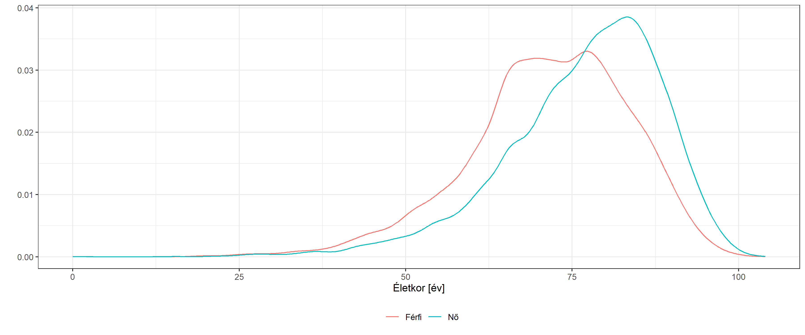
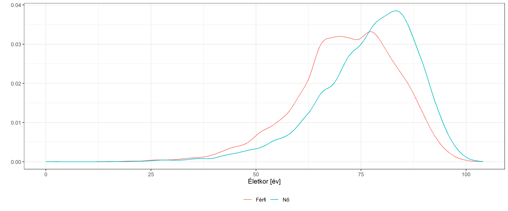
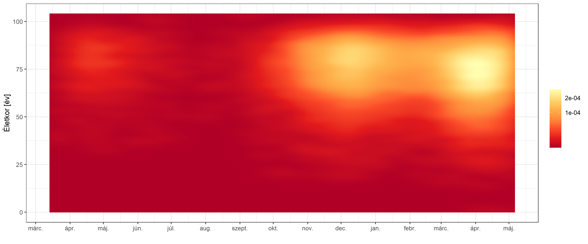
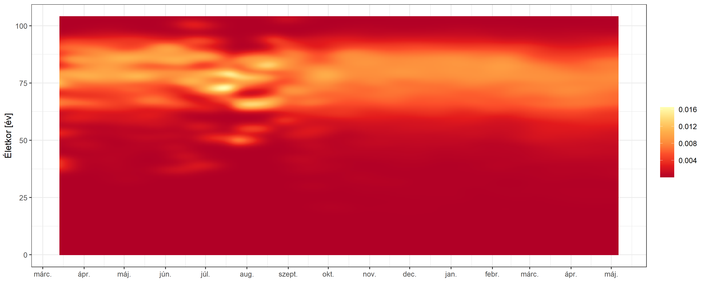
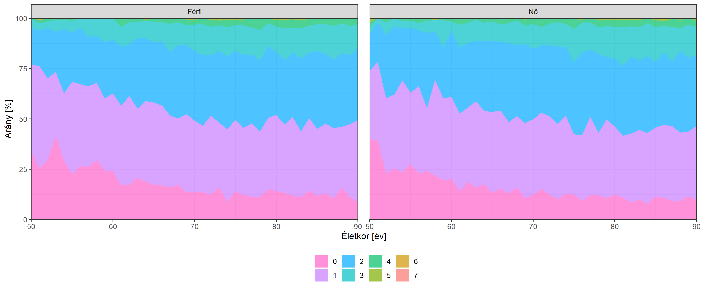

A magyarországi regisztrált koronavírusos halottak adatainak elemzése
================
Ferenci Tamás

## Bevezető gondolatok

A hivatalos magyar járványügyi adatszolgáltatás egyik nehezen érthető
vonása, hogy míg a legtöbb téren szinte minden információt, még a
legelemibbeket is visszatartja (az esetek számáról kizárólag egy járvány
kezdete összegzett értéket közöl feldolgozható formában, a területi
adatokat egy képfájlban (!) adja meg, amit minden nap lecserélnek, a
tesztek típusáról semmilyen információt nem ad meg stb. stb., érdemes
összevetni egy
[amerikai](https://www.doh.wa.gov/Emergencies/COVID19/DataDashboard)
vagy egy [angol](https://coronavirus.data.gov.uk/) adatközléssel, de
sajnos akár a
[macedónnal](https://gdi-sk.maps.arcgis.com/apps/opsdashboard/index.html#/2096bd4b051b42948ac3f5747e80c3a5)
adatközléssel is), addig egyetlen egy téren viszont páratlanul
részletes: ez az elhunytakra vonatkozó adatszolgáltatás. Egyedi adatokat
közölnek, életkorral, nemmel, és teljes társbetegség listával. Én az
abszolút élharcosa vagyok a teljes transzparenciának, de ez még
szerintem is szükségtelen, és nagyon komoly adatvédelmi kérdéseket vet
fel. (Nagyjából az első ezer halottig foglalkoztam ezzel, közülük 4-et
tudtam névvel-címmel teljes bizonyossággal beazonosítani családi és
ismerősi körömből származó információk alapján, és ilyen módon megtudni
az összes betegségüket. Beleértve mondjuk olyanokat, hogy alkoholos
májzsugor… Mindeközben arra a kérdésre, hogy a regisztrált eseteknek
miért nem közlik legalább az életkori eloszlását, mondjuk, hogy mennyi
eset volt 60 és 70 év között tegnap, az a válasz született a hivatalos
sajtótájékoztatón, hogy azért, “mert az lekövethetővé tenne embereket”.
Így!) Viszont ha már egyszer, akármilyen okból is, de ilyen részletes
adataink vannak, igyekezzünk azt felhasználni a járvány jobb
megismerésére, megértésére.

## Limitációk

*Bármilyen* adatforrás használatakor az első feladat, hogy megértsük
annak korlátait. A halottakra vonatkozó hazai adatszolgáltatás esetén
ezek a következők:

-   Az alapbetegségek megadásában semmiféle standardizálás nincs: a
    bevitelkor nem listáról kell választani (még a leggyakoribbakat
    sem), nem egységes kódrendszert kell használni a megadáshoz stb. Ez
    egyszerre éri el azt, hogy megnehezedik az adatot feltöltők munkája,
    hiszen kézzel kell bepötyögni minden egyes betegség-listát, és azt,
    hogy borzasztóan leromlik az adatminőség: rengeteg betegség neve
    néhol magyarul szerepel, néhol latinosan, néhol angolosan, néhol
    kiírva, néhol rövidítve, máshol betűszóval; mindez megspékelve
    elgépelések végeláthatatlan sorával. Csak az érzékeltetés kedvéért,
    azt, hogy az elhunytnak magasvérnyomás-betegsége volt, 24 (!)
    különböző formában leírva találtam meg az adatbázisban:
    magasvérnyomás-betegség, magasvényomás-betegség,
    magasvérnyomás-betegség., magasvérnyomás- betegség, magasvérnyomás
    betegség, magas vérnyomás betegség, magasvérnyomás -betegség, magas
    vérnyomás-betegség, magas vérnyomás- betegség,
    mgasvérnyomás-betegség, magasvérnyomás-betegéség,
    magasvérnyomás-betegség, magasvérnyomás-betegségi,
    nmagasvérnyomás-betegség, magasvérrnyomás-betegség,
    magasvérnoymás-betegség, magas vérnyomásbetegség,
    rmagasvérnyomás-betegség, magasvérnymás-betegség,
    agasvérnyomás-betegség, magarvérnyomás-betegség, m. hypertonicus,
    hypertonia, hipertónia. És még egyszer: ezt az adatminőséget azzal
    érjük el, hogy komoly plusz-munkát akasztunk az adatszolgáltatók
    nyakába… A járvány legelején még megértettem, hogy hirtelen kellett
    valamit kitalálni, és ezért lett az a rendszer, de hogy így, több
    mint egy év elteltével (beleértve több hónapnyi nyugalmat 2020
    nyarán) sem sikerült egy olyan adatszolgáltatási rendszert
    kialakítani, amiben mondjuk a leggyakoribb 10-20 betegséget
    bepipálással kell kiválasztani, és az egyebek is lehetőleg egy
    standard listáról választhatóak, arra semmiféle racionális
    magyarázatom nincsen.
-   Nincsen szemantikusan jelölve, hogy egyáltalán mi választja el a
    különböző alapbetegségeket egymástól a felsorolásban, így még azt
    sem lehet megbízhatóan megállapítani, hogy hol végződik az egyik
    betegség a felsorolásban, és hol kezdődik a következő. Kézenfekvőnek
    tűnik a vessző, de nem univerzális: van pontosvessző, pont, sőt,
    szóköz (vagy dupla szóköz). Azonban azt sem lehet mondani, hogy
    akkor mindegyik ilyennél vágjuk szét, hiszen a “chr.
    veseelégtelenség” az egy betegség (chr = krónikus) nem a “chr” és a
    “veseelégtelenség” betegségek egymás után felsorolva; a szóközről
    meg nyilván beszélni is felesleges. Hogy a dolog még rosszabb
    legyen, a probléma fordítva is fennáll, mert még a vessző sem
    feltétlenül jó szétvágáshoz, előfordul például “szív-, érrendszeri
    betegség”. Nehéz megérteni, hogy aki ezt ilyen formában begyűjteti,
    az hogyan gondolhatja azt, hogy ez később *bármilyen* célra alkalmas
    lesz (akkor viszont minek begyűjteni?!). A későbbiekben ezt
    megpróbálom amennyire lehet szövegfeldolgozási eszközökkel megoldni,
    de megint ugyanaz, hogy komoly munkával igyekszem egy legalább
    félig-meddig használható formát kicsiholni az adatforrásból, ami
    azért szükséges, mert az – amúgy is végletesen túlterhelt –
    kórházaknak és orvosoknak komoly munkát ad, hogy ilyen rossz
    formátumban közöljenek adatot…
-   Könnyen megoldható probléma, de azért jellemző adalék, hogy még a
    halottak *nemének* a megadását sem sikerült egységesen
    megoldani… 2021. május 7-i állapot szerint 1524 “Nő” van, 2433 “Nõ”
    és 9816 “nõ”.
-   Valójában még azt sem sikerült tökéletesen megoldani, hogy a sorszám
    sorszám legyen. 2021. május 7-i állapot szerint az 1762-es beteg
    után ismét az 1762-es jön, cserében utána az 1764-es. Apróság, de
    azért elgondolkodtató, hogy egy olyan nyilvánvalóan (?) automatikus
    dolog, minthogy a sorszám mindig eggyel nőjön, hogyan tud elromlani.
    Merem remélni, hogy nem valaki kézzel irogat be eggyel nagyobb
    számokat?!
-   A halálozások dátuma egész egyszerűen nincsen megadva. (Mindeközben
    egy – egyébként teljesen felesleges és semmilyen célra nem
    használható – sorszámozás igen.) Tudom, hogy abszurd, de az egyetlen
    megoldás a halálozások dátumhoz rendeléséhez az, ha az ember megnézi
    a napi halálozások számát minden napra (amit természetesen
    nemzetközi adatszolgáltatásból, vagy lelkes önkéntesek kézzel kiírt
    tábláiból kell megszerezni, mert ilyen nyilvános hazai adatközlés
    ugyebár nincsen), majd ilyen lépésekben haladva feldarabolja az
    adatbázist…
-   A hivatalos adatszolgáltatás sem mondja az ellenkezőjét, de azért
    tisztázni sem siet, és láthatólag sokan nem is értik, hogy a közlés
    dátuma a halál *jelentésének* és nem a *bekövetkezésének* a dátuma.
    A hivatalos adatközlés semmit nem szól arról, hogy mi a bekövetkezés
    dátuma, márpedig a kettő eltérhet egymástól, pláne, ha sok halálozás
    van és ezért torlódnak az adatok.
-   Bár az adatszolgáltatás részletes, de a további feldolgozást enyhén
    szólva sem könnyíti meg: egyáltalán nem teszi letölthetővé az
    adatokat, és a webes megjelenítést 50-esével tördeli, hogy még
    kézzel kimásolni se lehessen az adatokat.

## Technikai részletek: az adatok letöltése

Az adatok leszedésére, mint az előbb is láttuk, csak gépi úton van
remény. Természetesen az `rvest` csomagot fogjuk használni, mely az
egyik legjobb eszköz `R` alatt az ilyen feladatokhoz.

Az adatbázisok kezeléséhez a `data.table`, a későbbi vizualizációhoz a
`ggplot2` csomagot fogjuk használni:

``` r
library(data.table)
library(ggplot2)
theme_set(theme_bw())
```

A scrape-eléshez első lépésben az `xml2` csomaggal beolvassuk a központi
oldalt, majd egy XPath azonosítással megkeressük a legutolsó oldal
számát:

``` r
pg <- xml2::read_html("https://koronavirus.gov.hu/elhunytak")
lastpg <- strsplit(rvest::html_attr(rvest::html_node(pg, xpath = "//li[@class='pager-last']/a"), "href"), "=")[[1]][2]
```

Ezt követően már tudjuk, hogy meddig kell menni; ezeket az oldalakat
egyesével leszedjük (`xml2::read_html`) és az `rvest::html_table`-lel
parse-oljuk:

``` r
MortData <- rbindlist(lapply(0:lastpg, function(i) rvest::html_table(xml2::read_html(paste0("https://koronavirus.gov.hu/elhunytak?page=", i)))[[1]]))
```

Adjunk rövid neveket az oszlopoknak:

``` r
names(MortData) <- c("ID", "Sex", "Age", "Comorbidities")
```

Nézzük meg mennyire sikerült a neveket egységesen megadni:

``` r
knitr::kable(table(MortData$Sex), col.names = c("Írásmód", "Gyakoriság"))
```

| Írásmód | Gyakoriság |
|:--------|-----------:|
| férfi   |      10280 |
| Férfi   |       4390 |
| no      |       9877 |
| No      |       2433 |
| Nő      |       1524 |

Nem túlságosan, úgyhogy ezt javítsuk ki:

``` r
MortData$Sex <- as.factor(ifelse(MortData$Sex%in%c("férfi", "Férfi"), "Férfi", "Nő"))
```

A későbbiekhez (de kizárólag vizualizációs célokra! nem elemzéshez!)
kiszámítunk egy kategorizált életkort is:

``` r
MortData$AgeCut <- cut(MortData$Age, c(-Inf, 50, 60, 70, 80, 90, Inf), right = FALSE,
                       labels = c("<50", "50-60", "60-70", "70-80", "80-90", "90+"))
```

Ahogy volt róla szó, dátumhoz csak úgy tudunk rendelni, ha megnézzük a
halálozások idősorát. Szedjük le az OWID-tól, és vonjuk ki egy napot a
dátumból, mert az adott napon jelentett halálozások valójában az előző
napon történtek:

``` r
RawData <- fread("https://covid.ourworldindata.org/data/owid-covid-data.csv")
RawData$date <- RawData$date-1
```

Vegyük ki Magyarországot, majd a hozzárendelést oldjuk meg olyan módon,
hogy minden dátumot megismétlünk annyiszor, amennyi az aznapi jelentett
halálok száma. Ha ezek összege nem egyezik a legyűjtött elhunytak
számával, a legvégét hagyjuk el (olyan esetek, amik még nem jelentek meg
a halálozási idősorban). Mindezek előtt ne felejtsük el sorbarendezni az
elhunytak adatai növekvően:

``` r
NewDeathsHUN <- RawData[iso_code=="HUN", .(date, new_deaths)][!is.na(new_deaths)]
DeathDates <- rep(NewDeathsHUN$date, NewDeathsHUN$new_deaths)
MortData <- MortData[order(ID)][1:length(DeathDates)]
MortData$Date <- DeathDates
```

A kapott adatbázist mentsük is el, hogy az esetleges egyéb
felhasználóknak egyből elérhető legyen, és ne kelljen a letöltést
kivárni:

``` r
# saveRDS(MortData, "MortData.rds")
```

## Az adatbázis jellemzői

Jelen elemzés lezárásának a dátuma 2021-05-09, ekkor `nrow(MortData)`
elhunyt volt az adatbázisban, akinek halálozási időpontja is
beazonosítható volt. Jelen vizsgálat az ő adataik felhasználásával
készült.

## Az elhunytak életkor és nemi adatai

Kezdjük először a társbetegségeken kívüli két adattal, az életkorral és
a nemmel.

Az adatbázis szerint az elhunytak közül 14630 fő (51.5%) férfi.

Az életkori eloszlás:

``` r
ggplot(MortData, aes(x = Age)) + stat_density(geom = "line", position = "identity") + labs(x = "Életkor [év]", y = "")
```

<!-- -->

(Csábító lenne kiszámítani a korspecifikus halálozási arányt, de ne
feledjük, hogy nem tudhatjuk, hogy az átfertőzöttség függ-e az
életkortól.)

Az elhunytak életkori eloszlása nem szerint:

``` r
ggplot(MortData, aes(x = Age, color = Sex)) + stat_density(geom = "line", position = "identity") + labs(x = "Életkor [év]", y = "") +
  theme(legend.position = "bottom", legend.title = element_blank())
```

<!-- -->

(Ez az ábra a csoporton belüli eloszlást mutatja, tehát nem jeleníti
meg, hogy a férfiak és nők száma nem ugyanannyi.)

Ez annyiban félrevezető, hogy egybeönti az egész időszak adatait, pedig
ezek változhattak menet közben. Márpedig fontos lehet ezt is vizsgálni,
hátha eltolódik valamilyen irányba az elhunytak életkora! A férfiak és a
nők között nem volt nagy különbség, úgyhogy a továbbiakhoz kezeljük őket
egyben, viszont a kérdés vizsgálatához bontsuk meg az ábrát a dátum
szerint.

Elvileg minden naphoz egy ilyen eloszlást lehetne rajzolni, de ezt
hogyan jelenítsük meg átláthatóan? A megoldás, hogy a harmadik dimenzió
(az előbbi ábrán a függőleges tengely, tehát, hogy mennyire gyakori egy
adott életkor) ábrázolására színt fogunk használni. Így egy kétdimenziós
ábrát kapunk, egyik tengelyen az idő, másik tengelyen az életkor, és a
színezés jelzi, hogy adott időpontban adott életkor milyen gyakori.
Természetesen ezt nem lehet szó szerint naponként végezni, részint mert
lesznek napok, amikor nagyon kevés halálozás volt, ebből csak
bizonytalanul lehet becsülni életkori eloszlást, de még ha sok halott
van, akkor is érdemes a szomszéd napokat is használni, hogy javítsuk a
becslést, hiszen hirtelen változások nem valószínűek. Azaz amire
szükségünk van egy simítás, jelen esetben kétdimenziósan; ezt a
`MASS::kde2d`-vel fogjuk megoldani. (A `geom_density` is ezt használja.)
Arra vigyáznunk kell, hogy ez dátumot nem tud kezelni, úgyhogy először
numerikussá alakítjuk – ez szerencsére egyszerűen naponként fog nőni
egyesével – és majd a végén nem szabad elfelejtenünk visszaalakítani.
Egy technikai trükk, de érdemes a simítási sűrűséget úgy beállítani,
hogy a pontok száma épp a napok száma legyen (ez szép ábrázoláshoz bőven
elég), és így egész dátumokban fogjuk megkapni a sűrűséget.

``` r
MortData$NumDate <- as.numeric(MortData$Date)
temp <- MASS::kde2d(MortData$NumDate, MortData$Age, n = diff(range(MortData$NumDate))+1)
rownames(temp$z) <- temp$x
colnames(temp$z) <- temp$y
temp1 <- reshape2::melt(temp$z)
temp1$Var1 <- as.Date(temp1$Var1, origin = "1970-01-01")
```

(Megjegyzés: sokszor látni, hogy simítás helyett úgy oldják meg a
problémát, hogy több napot és/vagy több életkort összevonnak, például
havonta és 10 éves korcsoportokban dolgoznak. Ez helytelen, hiszen
információvesztéssel jár – elveszítjük a hónapon belüli és a 10 év
széles tartományon belüli mintázatot –, nem lehet jól megválasztani a
csoportosítást – miért pont hónap és nem 3 hét vagy 38 nap, miért pont
10 év és nem 9 vagy 11 – valamint azt feltételezi, hogy a csoportonként
belül állandó a sűrűség, míg a határán abrupt módon ugrik, aminek
nyilván nincs biológiai értelme. A korszerű és megfelelő eszköz az, ha a
folytonos változókat folytonosként kezeljük.)

Ábrázoljuk az eredményt, minél fehérebb a szín, annál nagyobb ott a
sűrűség, minél sötét:

``` r
ggplot(temp1, aes(x = Var1, y = Var2, fill = value)) + geom_tile() + scale_fill_distiller(palette = 'YlOrRd') + scale_x_date(date_breaks = "month", date_labels = "%b") + labs(x = "", y = "Életkor [év]", fill = "")
```

<!-- -->

Nem túl látványos amit kaptunk, ennek az az oka, hogy egyben van simítva
az egész adatsor, így a kiugró halálozási napok magas sűrűsége annyira
összenyomja a színskálát, hogy ezen kívül szinte minden
megkülönböztethetetlenné válik. Ezen segíthetünk, ha nem lineárisan
színezünk:

``` r
ggplot(temp1, aes(x = Var1, y = Var2, fill = value)) + geom_tile() + scale_fill_distiller(palette = 'YlOrRd', trans = "sqrt") + scale_x_date(date_breaks = "month", date_labels = "%b") + labs(x = "", y = "Életkor [év]", fill = "")
```

<!-- -->

(Ez négyzetgyök-transzformációval készült; a nagyon extrém alacsony
értékek miatt érdekes módon a logaritmus még annál is rosszabb eredményt
ad, mint a kiindulási ábra)

Az igazi megoldás azonban az, ha kiszámoljuk adott napra a *feltételes*
eloszlást, tehát hogy a napon *belül* milyen volt az életkorok
eloszlása. Ezt kézzel megtehetjük könnyen:

``` r
temp2 <- as.data.table(reshape2::melt(t(apply(temp$z, 1, function(x) x/sum(x)))))
temp2$Var1 <- as.Date(temp2$Var1, origin = "1970-01-01")
```

És ezt ábrázolva megkapjuk a megfelelő végeredményt:

``` r
ggplot(temp2, aes(x = Var1, y = Var2, fill = value)) + geom_tile() + scale_fill_distiller(palette = 'YlOrRd') + scale_x_date(date_breaks = "month", date_labels = "%b") + labs(x = "", y = "Életkor [év]", fill = "")
```

<!-- -->

Látványosabbá tehetjük az eredményt, ha feltüntetjük az átlagos életkort
(mivel nagyon finom felbontásban megvan az eloszlást, ezt könnyen
kiszámolhatjuk, lényegében numerikusan integrálunk), illetve ábrázoljuk
csak a relevánsabb életkortartományt:

``` r
ggplot(temp2, aes(x = Var1, y = Var2, fill = value)) + geom_tile() + scale_fill_distiller(palette = 'YlOrRd') +
  geom_line(data = temp2[,.(weighted.mean(Var2, value)),.(Var1)], aes(x = Var1, y = V1), inherit.aes = FALSE, color = "white") +
  lims(y = c(40, NA)) + scale_x_date(date_breaks = "month", date_labels = "%b") + labs(x = "", y = "Életkor [év]", fill = "")
```

    ## Warning: Removed 67459 rows containing missing values (geom_tile).

<!-- -->

## Technikai részletek: a társbetegségek kikódolása

Elsőként próbáljuk meg elkülöníteni egy elhunyt listáján belül a
különböző társbetegségeket. Ehhez muszáj kicsit kézzel is küzdeni, hogy
a nem elválasztást jelentő vesszőket kiküszöböljük, a `\n` típusú
újsorokat elválasztó vesszőre cseréljük (hogy ne bolondítsa meg a
későbbi táblázat-kiíratást):

``` r
MortData$Comorbidities2 <- MortData$Comorbidities
MortData$Comorbidities2 <- gsub("szív-, érrendszeri", "szív- és érrendszeri", MortData$Comorbidities2)
MortData$Comorbidities2 <- gsub("\n", ",", MortData$Comorbidities2)
```

Ez után daraboljunk vesszőnél és pontosvesszőnél (a szóköz és a pont,
bár előfordul tagoló-jelként, reménytelen). Távolítsuk el a vezető és
záró szóközöket, illetve most alakítsunk mindent kisbetűvé (ez javítja a
kis- és nagybetűs írásmódból fakadó eltéréseket, bár más szempontból nem
biztos, hogy jó, de erre később térünk vissza):

``` r
Comorbs <- lapply(strsplit(MortData$Comorbidities2, "[,;+]"), function(x) tolower(trimws(x)))
```

Nézzük meg mik a leggyakoribb komorbiditások:

``` r
knitr::kable(sort(table(unlist(Comorbs)), decreasing = TRUE)[1:50], col.names = c("Társbetegség", "Gyakoriság"))
```

| Társbetegség                      | Gyakoriság |
|:----------------------------------|-----------:|
| magasvérnyomás-betegség           |      10452 |
| cukorbetegség                     |       8083 |
| magas vérnyomás                   |       8050 |
| iszkémiás szívbetegség            |       2980 |
| szívbetegség                      |       2261 |
| demencia                          |       1951 |
| szívelégtelenség                  |       1493 |
| krónikus veseelégtelenség         |       1481 |
| szívritmuszavar                   |       1309 |
| veseelégtelenség                  |       1249 |
| daganatos megbetegedés            |       1239 |
| tüdobetegség                      |       1145 |
| érelmeszesedés                    |        896 |
| vérszegénység                     |        835 |
| kóros elhízás                     |        795 |
| pitvarfibrilláció                 |        772 |
| nem ismert alapbetegség           |        743 |
| asztma                            |        705 |
| krónikus obstruktív tüdobetegség  |        684 |
| agyi infarktus                    |        633 |
| elhízás                           |        630 |
| parkinson-kór                     |        615 |
| stroke                            |        607 |
| pangásos szívelégtelenség         |        519 |
| adat feltöltés alatt              |        467 |
| epilepszia                        |        444 |
| általános érelmeszesedés          |        422 |
| májbetegség                       |        397 |
| érszukület                        |        393 |
| alzheimer-kór                     |        337 |
| csontritkulás                     |        324 |
| reflux                            |        309 |
| depresszió                        |        287 |
| magasvérnyomás betegség           |        259 |
| daganatos betegség                |        249 |
| pajzsmirigybetegség               |        241 |
| vesebetegség                      |        237 |
| pajzsmirigy betegség              |        235 |
| magas vérzsírszint                |        229 |
| tüdogyulladás                     |        221 |
| pajzsmirigy alulmuködés           |        215 |
| szív- és érrendszeri megbetegedés |        190 |
| szív- és érrendszeri betegség     |        183 |
| tüdoembólia                       |        168 |
| idült iszkémiás szívbetegség      |        161 |
| krónikus tüdobetegség             |        161 |
| köszvény                          |        155 |
| szívinfarktus                     |        147 |
| agysorvadás                       |        144 |
| agykárosodás                      |        143 |

Szedjük ki az egyedi neveket:

``` r
IndivComorbNames <- unique(unlist(Comorbs))
IndivComorbNames <- IndivComorbNames[IndivComorbNames!=""]
```

Az elhunytaknak összesen `length(IndivComorbNames)` egyedi
társbetegségük van.

Az elgépelések ellen legjobban védekezni sztring-hasonlóság kereséssel
lehet. Használjuk a `stringdist` csomagot, mely beépítetten a
korlátozott Damerau-Levenshtein távolságmetrikát alkalmazza:

``` r
# similarityres <- stringdist::stringsimmatrix(IndivComorbNames, IndivComorbNames)
similarityres <- outer(IndivComorbNames, IndivComorbNames, stringdist::stringsim)
```

Ez megadja valamennyi megadott egyedi társbetegség-pár hasonlóságát.
Például azon társbetegségek listája, melyek legalább 0, 8 hasonlóságúak
a magasvérnyomás-betegséggel:

``` r
knitr::kable(IndivComorbNames[which(similarityres[which(IndivComorbNames=="magasvérnyomás-betegség"),]>0.8)], col.names = "Megnevezés")
```

| Megnevezés                |
|:--------------------------|
| magasvérnyomás-betegség   |
| magas vérnyomás betegség  |
| magarvérnyomás-betegség   |
| magasvérnyomás betegség   |
| agasvérnyomás-betegség    |
| magasvérnyomás- betegség  |
| magasvérnymás-betegség    |
| rmagasvérnyomás-betegség  |
| magas vérnyomásbetegség   |
| magasvérnyomás -betegség  |
| magasvérnoymás-betegség   |
| magas vérnyomás-betegség  |
| magasvérrnyomás-betegség  |
| nmagasvérnyomás-betegség  |
| magasvérnyomás-betegségi  |
| magasvérnyomás-betegség   |
| magasvérnyomás-betegéség  |
| mgasvérnyomás-betegség    |
| magas vérnyomás- betegség |
| magasvérnyomás-betegség.  |
| magasvényomás-betegség    |

A probléma, hogy ekkora listában teljesen reménytelen ezeket kézzel
megkeresni. Szerencsére egy ügyes trükkel ezen segíthetünk. Csináljunk
egy hierarchikus klaszterezést, majd a kapott fát vágjuk el adott
mélységben! Arra vigyázzunk egyedül, ehhez távolságra van szükségünk,
így használjunk 1 mínusz hasonlóságot:

``` r
h <- cutree(hclust(as.dist(1-similarityres)), h = 0.2)
```

Szedjük ki az összes halmazt:

``` r
res <- lapply(unique(h), function(x) IndivComorbNames[h==x])
resDF <- as.data.table(plyr::ldply(res, rbind))
```

Ezzel lényegében véletlenszerűen kapjuk meg a halmazokat. Összesen 2957
halmazunk keletkezett. Az egyes halmazok tartalmát jól megadja az első
elemük (az első oszlop), mert az mindenképp létezik. Nézzük meg az első
20-at, nem feledve, hogy itt az “első” semmiféle érdemi sorrendet nem
jelent:

``` r
knitr::kable(resDF[1:20, 1], col.names = "Halmaz első eleme")
```

| Halmaz első eleme      |
|:-----------------------|
| szív és érrendszeri    |
| rosszindulatú daganat  |
| magas vérnyomás        |
| krónikus pancreatitis  |
| alkoholos májkárosodás |
| aorta stenosis         |
| iszb                   |
| pitvarfibrilláció      |
| nincs adat             |
| encephalopathia        |
| hepatopathia           |
| érszűkület             |
| hypothyreosis          |
| tbc                    |
| lc                     |
| pe                     |
| ht                     |
| dm                     |
| diab. polyneuropathia  |
| mvt                    |

Természetesen könnyen rákereshetünk egy adott kifejezésre:

``` r
knitr::kable(resDF[grep("magasvérnyomás-betegség",resDF[[1]])])
```

| 1                                                              | 2                                                | 3                                     | 4                                      | 5                                     | 6                                      | 7                      | 8                        | 9                       | 10                       | 11                      | 12                       | 13                       | 14                       | 15                       | 16                      | 17                       | 18                     | 19                        | 20                       | 21                     |
|:---------------------------------------------------------------|:-------------------------------------------------|:--------------------------------------|:---------------------------------------|:--------------------------------------|:---------------------------------------|:-----------------------|:-------------------------|:------------------------|:-------------------------|:------------------------|:-------------------------|:-------------------------|:-------------------------|:-------------------------|:------------------------|:-------------------------|:-----------------------|:--------------------------|:-------------------------|:-----------------------|
| magasvérnyomás-betegség                                        | magas vérnyomás betegség                         | magarvérnyomás-betegség               | magasvérnyomás betegség                | agasvérnyomás-betegség                | magasvérnyomás- betegség               | magasvérnymás-betegség | rmagasvérnyomás-betegség | magas vérnyomásbetegség | magasvérnyomás -betegség | magasvérnoymás-betegség | magas vérnyomás-betegség | magasvérrnyomás-betegség | nmagasvérnyomás-betegség | magasvérnyomás-betegségi | magasvérnyomás-betegség | magasvérnyomás-betegéség | mgasvérnyomás-betegség | magas vérnyomás- betegség | magasvérnyomás-betegség. | magasvényomás-betegség |
| magasvérnyomás-betegség súlyos mentális hanyatlás              |                                                  |                                       |                                        |                                       |                                        |                        |                          |                         |                          |                         |                          |                          |                          |                          |                         |                          |                        |                           |                          |                        |
| krónikus magasvérnyomás-betegség                               |                                                  |                                       |                                        |                                       |                                        |                        |                          |                         |                          |                         |                          |                          |                          |                          |                         |                          |                        |                           |                          |                        |
| leukémia magasvérnyomás-betegség                               |                                                  |                                       |                                        |                                       |                                        |                        |                          |                         |                          |                         |                          |                          |                          |                          |                         |                          |                        |                           |                          |                        |
| magasvérnyomás-betegség. iszkémiás szívbetegség                | magasvérnyomás-betegség iszkémiás szívbetegség   |                                       |                                        |                                       |                                        |                        |                          |                         |                          |                         |                          |                          |                          |                          |                         |                          |                        |                           |                          |                        |
| magasvérnyomás-betegség (elsődleges)                           | magasvérnyomás-betegség (elsodleges)             |                                       |                                        |                                       |                                        |                        |                          |                         |                          |                         |                          |                          |                          |                          |                         |                          |                        |                           |                          |                        |
| cukorbetegség. magasvérnyomás-betegség                         | cukorbetegség magasvérnyomás-betegség            | cukorbetegség magasvérnyomás-betegség | érbetegség magasvérnyomás-betegség     | szívbetegség. magasvérnyomás-betegség |                                        |                        |                          |                         |                          |                         |                          |                          |                          |                          |                         |                          |                        |                           |                          |                        |
| magasvérnyomás-betegség. demencia                              |                                                  |                                       |                                        |                                       |                                        |                        |                          |                         |                          |                         |                          |                          |                          |                          |                         |                          |                        |                           |                          |                        |
| magasvérnyomás-betegség betegség                               | magasvérnyomás-betegség szívbetegség             | magasvérnyomás-betegség cukorbetegség | magasvérnyomás-betegség. cukorbetegség | magasvérnyomás-betegség tüdobetegség  | magasvérnyomás betegség. cukorbetegség |                        |                          |                         |                          |                         |                          |                          |                          |                          |                         |                          |                        |                           |                          |                        |
| magasvérnyomás-betegség érszukület                             | magasvérnyomás-betegség. érszukület              |                                       |                                        |                                       |                                        |                        |                          |                         |                          |                         |                          |                          |                          |                          |                         |                          |                        |                           |                          |                        |
| tüdogyulladás. magasvérnyomás-betegség                         | tüdogyulladás magasvérnyomás-betegség            |                                       |                                        |                                       |                                        |                        |                          |                         |                          |                         |                          |                          |                          |                          |                         |                          |                        |                           |                          |                        |
| magasvérnyomás-betegség krónikus veseelégtelenség              |                                                  |                                       |                                        |                                       |                                        |                        |                          |                         |                          |                         |                          |                          |                          |                          |                         |                          |                        |                           |                          |                        |
| magasvérnyomás-betegség pajzsmirigy-alulmuködés                | magasvérnyomás-betegség. pajzsmirigy-alulmuködés |                                       |                                        |                                       |                                        |                        |                          |                         |                          |                         |                          |                          |                          |                          |                         |                          |                        |                           |                          |                        |
| daganatos megbetegedés magasvérnyomás-betegség                 | daganatos megbetegedés magasvérnyomás-betegség   |                                       |                                        |                                       |                                        |                        |                          |                         |                          |                         |                          |                          |                          |                          |                         |                          |                        |                           |                          |                        |
| iszkémiás szívbetegség. magasvérnyomás-betegség                |                                                  |                                       |                                        |                                       |                                        |                        |                          |                         |                          |                         |                          |                          |                          |                          |                         |                          |                        |                           |                          |                        |
| pangásos szívelégtelenség. magasvérnyomás-betegség             |                                                  |                                       |                                        |                                       |                                        |                        |                          |                         |                          |                         |                          |                          |                          |                          |                         |                          |                        |                           |                          |                        |
| magasvérnyomás-betegség daganatos megbetegedés                 |                                                  |                                       |                                        |                                       |                                        |                        |                          |                         |                          |                         |                          |                          |                          |                          |                         |                          |                        |                           |                          |                        |
| kezelt magasvérnyomás-betegség                                 | kezeletlen magasvérnyomás-betegség               |                                       |                                        |                                       |                                        |                        |                          |                         |                          |                         |                          |                          |                          |                          |                         |                          |                        |                           |                          |                        |
| magasvérnyomás-betegség köszvény                               |                                                  |                                       |                                        |                                       |                                        |                        |                          |                         |                          |                         |                          |                          |                          |                          |                         |                          |                        |                           |                          |                        |
| magasvérnyomás-betegség szövodményekkel                        |                                                  |                                       |                                        |                                       |                                        |                        |                          |                         |                          |                         |                          |                          |                          |                          |                         |                          |                        |                           |                          |                        |
| magasvérnyomás-betegség kóros elhízás                          |                                                  |                                       |                                        |                                       |                                        |                        |                          |                         |                          |                         |                          |                          |                          |                          |                         |                          |                        |                           |                          |                        |
| magasvérnyomás-betegség vérmérgezés                            |                                                  |                                       |                                        |                                       |                                        |                        |                          |                         |                          |                         |                          |                          |                          |                          |                         |                          |                        |                           |                          |                        |
| magasvérnyomás-betegség. szívmutét                             |                                                  |                                       |                                        |                                       |                                        |                        |                          |                         |                          |                         |                          |                          |                          |                          |                         |                          |                        |                           |                          |                        |
| elhízás magasvérnyomás-betegség                                |                                                  |                                       |                                        |                                       |                                        |                        |                          |                         |                          |                         |                          |                          |                          |                          |                         |                          |                        |                           |                          |                        |
| magasvérnyomás-betegség. cukorbetegség. iszkémiás szívbetegség |                                                  |                                       |                                        |                                       |                                        |                        |                          |                         |                          |                         |                          |                          |                          |                          |                         |                          |                        |                           |                          |                        |
| szív- és érrendszeri betegség magasvérnyomás-betegség          |                                                  |                                       |                                        |                                       |                                        |                        |                          |                         |                          |                         |                          |                          |                          |                          |                         |                          |                        |                           |                          |                        |

(Jól látszik a rengeteg tagolási hiba, elmaradt vessző.)

A lényegében véletlenszerű sorrend helyett logikusabb, ha darabszám
szerint rendezzük sorrendbe (mármint, hogy az egyes halmazokban hány
elem van); így rendezve az első néhány halmaz:

``` r
knitr::kable(resDF[order(apply(resDF, 1, function(x) sum(!is.na(x))), decreasing = TRUE),][1:50])
```

| 1                                       | 2                                      | 3                                     | 4                                      | 5                                        | 6                                        | 7                                        | 8                               | 9                                | 10                                  | 11                                  | 12                               | 13                                | 14                                   | 15                        | 16                        | 17                       | 18                         | 19                        | 20                         | 21                     |
|:----------------------------------------|:---------------------------------------|:--------------------------------------|:---------------------------------------|:-----------------------------------------|:-----------------------------------------|:-----------------------------------------|:--------------------------------|:---------------------------------|:------------------------------------|:------------------------------------|:---------------------------------|:----------------------------------|:-------------------------------------|:--------------------------|:--------------------------|:-------------------------|:---------------------------|:--------------------------|:---------------------------|:-----------------------|
| magasvérnyomás-betegség                 | magas vérnyomás betegség               | magarvérnyomás-betegség               | magasvérnyomás betegség                | agasvérnyomás-betegség                   | magasvérnyomás- betegség                 | magasvérnymás-betegség                   | rmagasvérnyomás-betegség        | magas vérnyomásbetegség          | magasvérnyomás -betegség            | magasvérnoymás-betegség             | magas vérnyomás-betegség         | magasvérrnyomás-betegség          | nmagasvérnyomás-betegség             | magasvérnyomás-betegségi  | magasvérnyomás-betegség   | magasvérnyomás-betegéség | mgasvérnyomás-betegség     | magas vérnyomás- betegség | magasvérnyomás-betegség.   | magasvényomás-betegség |
| krónikus veseelégtelenség               | krónikus vese elégtelenség             | krónikus veselégtelenség              | krónikus vesseelégtelenség             | krónikus veseelégtelenség                | krónuikus veseelégtelenség               | krónikus veseelégtelensége               | krónikus veseelégtenség         | krónikus veseeégtelenség         | kónikus veseelégtelenség            | krónius veseelégtelenség            | krónikus veseelgtelenség         | krónikus vesselégtelenség         | krónikus veseelégtelen               | krrónkus veseelégtelenség | kórnikus veseleégtelenség | króikus veseelégtelenség | krónikus veseelégteleneség | krónikus veseelételenség  | krónikus veseelégetelenség |                        |
| magas vérnyomás                         | magasa vérnyomás                       | magas vérmyomás                       | magasvérnyomás                         | magas vérnyomás.                         | maga svérnyomás                          | magas vérnyomés                          | magas vérnomás                  | magasv érnyomás                  | magas vérrnyomás                    | magas vérnyomás                     | magas vérmnyomás                 | magas vényomás                    | magas vérnyomása                     | magas-vérnyomás           |                           |                          |                            |                           |                            |                        |
| szív- és érrendszeri megbetegedés       | szív -és érrendszeri megbetegedés      | szív és érrendszeri megbetegedés      | szív-és érrendszeri megbetegedés       | szív- és érrendszeri megbetegedések      | szív és érrendszeri megbetegedések       | szí- és érrendszeri megbetegedés         | szív és érrendszeri megbetegdés | szív- és érrenszeri megbetegedés | szív- és érrendzseri megbetegedések | szív- és érrendszeri megbetgedés    | szív- és érrendszer megbetegedés | szív- és érrendszeri megbetegédes | szív- és érrendszeri megbegbetegedés |                           |                           |                          |                            |                           |                            |                        |
| krónikus obstruktív tüdőbetegség        | krónikus obstuktív tüdőbetegség        | krónikus obstruktív tüdobetegség      | krónbikus obstruktív tüdobetegség      | króniksu obstruktív tüdobetegség         | krónukis obstruktív tüdobetegség         | krónikus obtruktív tüdőbetegség          | krónikus obtruktív tüdobetegség | krónikus obstriktív tüdobetegség | krónikus obstruktiv tüdobetegség    | krónikus obstruktív tüdobetegségség | krónikus obstrukív tüdobetegség  | krónikus instruktív tüdobetegség  | krónikus instruktív tüdobetegség     |                           |                           |                          |                            |                           |                            |                        |
| iszkémiás szívbetegség                  | iszkémiás szívbetegségek               | iszkémiás szívbeegség                 | iszkmiás szívbetegség                  | iszkémiás szívebetegség                  | iszkémias szívbetegség                   | iszkémiás szívbetegség                   | iszkémiás szivbetegség          | iszkémiás szívbetegség?          | iszkémiás szívbetegség              | iszkémiás szívbetegség.             | iszkémiás szívbtegség            | iszkémiáss szívbetegség           | iszkémás szívbetegség                |                           |                           |                          |                            |                           |                            |                        |
| emlő rosszindulatú daganata             | gége rosszindulatú daganata            | bél rosszindulatú daganata            | méh rosszindulatú daganata             | arc rosszindulatú daganata               | bor rosszindulatú daganata               | agy rosszindulatú daganata               | máj rosszindulatú daganata      | here rosszindulatú daganata      | emlo rosszindulatú daganata         | száj rosszindulatú daganata         | a máj rosszindulatú daganata     | a bor rosszindulatú daganata      |                                      |                           |                           |                          |                            |                           |                            |                        |
| veseelégtelenség                        | vese elégtelenség                      | veselégtelenség                       | veseelégteleneség                      | veseelégtelensség                        | veveelégtelenség                         | veseelégtelenésg                         | veseelégteleség                 | veseelégteneség                  | veseelételenség                     | veseelgételenség                    |                                  |                                   |                                      |                           |                           |                          |                            |                           |                            |                        |
| szívritmuszavar                         | szívritmus zavar                       | szívritmus-zavar                      | szívritmuszavarok                      | szívritmuszvar                           | szivritmuszavar                          | szavritmuszavar                          | szívrtmuszavar                  | szívtitmuszavar                  | szívritmuszvara                     | szívitmuszavar                      |                                  |                                   |                                      |                           |                           |                          |                            |                           |                            |                        |
| pivarfibrilláció                        | pitvarfibrillácó                       | pitvafribrilláció                     | fitvarfibrilláció                      | pitvarfibrilláló                         | pitvarfibrillácio                        | pitvarfirilláció                         | pirvarfibrilláció               | pitvafibrilláció                 | pitvaribrilláció                    | pitvarfibrillláció                  |                                  |                                   |                                      |                           |                           |                          |                            |                           |                            |                        |
| szívelégtelenség                        | szíveleégtelenség                      | szívelégetelnség                      | szívelégtlenség                        | szivelégtelenség                         | szívbelégtelenség                        | szívelégelenség                          | szívelégtelenég                 | szívelégtelenség.                | szívelégetelenség                   |                                     |                                  |                                   |                                      |                           |                           |                          |                            |                           |                            |                        |
| pajzsmirigy túlműködés                  | pajzsmirigy-túlműködés                 | pajzsmirigy túlműködése               | pajzsmirigy túlmuködés                 | pajzsmirígy túlmuködés                   | pajzsmirigy-túlmuködés                   | pajzsmirigy túlmuködés                   | pajzsmirigy túlmuködése         | pajzsmirigy- túlmuködés          | pajzsmirigy túlmuködési             |                                     |                                  |                                   |                                      |                           |                           |                          |                            |                           |                            |                        |
| parkinson-kór                           | parkinsor-kór                          | parkinson kór                         | parkinson- kór                         | parkison-kór                             | parkinsonkór                             | parkinson-kór                            | parkinon-kór                    | parkinson&lt;U+0096&gt;kór       | pakinson-kór                        |                                     |                                  |                                   |                                      |                           |                           |                          |                            |                           |                            |                        |
| szívbillentyű elégtelenség              | szívbillentyű elégtelensége            | szívbillentyu elégtelenség            | szivbillentyu elégtelenség             | szívbillentyű-elégtelenség               | szívbillentyuelégtelenség                | szívbillentyu elégtelensége              | szívbillentyu-elégtelenség      | szívbillenytu elégtelenség       | szív billentyu elégtelenség         |                                     |                                  |                                   |                                      |                           |                           |                          |                            |                           |                            |                        |
| érelmeszesedés                          | érelemszesedés                         | érelmeszsesedés                       | érelmeszsedés                          | érelemeszesedés                          | érlemeszesedés                           | érelmeszesedéss                          | érelmeszeseés                   | érelmeszesedés.                  |                                     |                                     |                                  |                                   |                                      |                           |                           |                          |                            |                           |                            |                        |
| daganatos megbetegedés                  | dagantos megbetegedés                  | daganatos megbetegedések              | dagnatos megbetegedés                  | daganatos megbetegdés                    | daganatos megebetegedés                  | dagaatos megbetegedés                    | daganatos megbetegedést         | daganatos megbetgedés            |                                     |                                     |                                  |                                   |                                      |                           |                           |                          |                            |                           |                            |                        |
| pajzsmirigy alulműködés                 | pajzsmirigy-alulműködés                | pajzsmirigy alul működés              | pajzsmirigy alulmuködés                | pajzsmirígy alulmuködés                  | pajzsmirigy alulműködése                 | pajzsmirigy alulmüködés                  | pajzsmirigy alulmuködése        | pajzsmirigy alulmuködés.         |                                     |                                     |                                  |                                   |                                      |                           |                           |                          |                            |                           |                            |                        |
| idült obstruktív tüdőbetegség           | idült obstruktív tüdobetegség          | idült obstructiv tüdobetegség         | idült obstruktiv tüdobetegség          | idület obstruktív tüdobetegség           | idült obstructív tüdobetegség            | idült obstruktív tüd?betegség            | idült obstruktív tüdobetegség.  | idült instruktív tüdobetegség    |                                     |                                     |                                  |                                   |                                      |                           |                           |                          |                            |                           |                            |                        |
| pajzsmirigy betegség                    | pajzsmirigybetegség                    | pajzsmirígybetegség                   | pajzsirigy betegség                    | pajzsmirigy-betegség                     | pajzsmirigy betegsége                    | pajzsmrigybetegség                       | pazsmirigy-betegség             | pajzsmirigy -betegség            |                                     |                                     |                                  |                                   |                                      |                           |                           |                          |                            |                           |                            |                        |
| aorta billentyű szűkülete               | aorta billentyű szűkület               | aorta billentyu szukülete             | aorta billentyu szukület               | aortabillentyu szukülete                 | aorta billentyuszukület                  | aortabillentyu szukület                  | aortabillentyu-szukület         | aortabillentyű szűkület          |                                     |                                     |                                  |                                   |                                      |                           |                           |                          |                            |                           |                            |                        |
| szív- és érrendszeri betegség           | szív és érrendszeri betegség           | szív-és érrendszeri betegség          | szív- és érrendszeri betegségek        | szív- és érrendszer betegség             | szív- és érrendszerri betegség           | szív és érendszeri betegség              | szív- és érrendszer betegsége   |                                  |                                     |                                     |                                  |                                   |                                      |                           |                           |                          |                            |                           |                            |                        |
| cukorbetegég                            | cukorbtegség                           | cukor betegség                        | cukorbetgség                           | cukoerbetegség                           | cukorbeegség                             | cukorbetgeség                            | cukorbetegésg                   |                                  |                                     |                                     |                                  |                                   |                                      |                           |                           |                          |                            |                           |                            |                        |
| vérszegénység                           | vérszegénység                          | érszegénység                          | vérszegésnység                         | vérszegnység                             | vérszegényég                             | vérzegénység                             |                                 |                                  |                                     |                                     |                                  |                                   |                                      |                           |                           |                          |                            |                           |                            |                        |
| epilepszia                              | epilepsia                              | epilepzsia                            | epilepszia                             | epillepszia                              | epliepszia                               | epiliepszia                              |                                 |                                  |                                     |                                     |                                  |                                   |                                      |                           |                           |                          |                            |                           |                            |                        |
| mélyvénás trombózis                     | mélyvénás thrombózis                   | mélyvénas trombozis                   | mélyvénás trombozis                    | mélyvénás trombosis                      | mélyvénás thrombosis                     | mélyvénástrombózis                       |                                 |                                  |                                     |                                     |                                  |                                   |                                      |                           |                           |                          |                            |                           |                            |                        |
| agyi keringési zavar                    | agyi keringészavar                     | agyi keringés zavara                  | agyi keringés zavar                    | agy keringési zavara                     | agyi keringési zavarok                   | agyi kerngési zavar                      |                                 |                                  |                                     |                                     |                                  |                                   |                                      |                           |                           |                          |                            |                           |                            |                        |
| a máj másodlagos rosszindulatú daganata | tüdo másodlagos rosszindulatú daganata | máj másodlagos rosszindulatú daganata | tüd? másodlagos rosszindulatú daganata | gerinc másodlagos rosszindulatú daganata | a tüdo másodlagos rosszindulatú daganata | a tüd? másodlagos rosszindulatú daganata |                                 |                                  |                                     |                                     |                                  |                                   |                                      |                           |                           |                          |                            |                           |                            |                        |
| vastagbél rosszindulatú daganata        | vakbél rosszindulatú daganata          | végbél rosszindulatú daganata         | vastagbél rosszindulatú daganata       | végbél rosszindulatu daganata            | vastagbél rosszindulatú daganat          | vastagbél rosszindulatu daganata         |                                 |                                  |                                     |                                     |                                  |                                   |                                      |                           |                           |                          |                            |                           |                            |                        |
| aorta szűkület                          | aortaszűkület                          | aorta-szűkület                        | aortaszukület                          | aorta szűkülete                          | aorta szukület                           | aorta szukülete                          |                                 |                                  |                                     |                                     |                                  |                                   |                                      |                           |                           |                          |                            |                           |                            |                        |
| krónikus tüdőbetegség                   | krónikus tüdőbetegségek                | krónikus tudobetegség                 | krónikus tüdobetegség                  | krónikus tüdobetegség                    | krónikus tüdobetegség.                   |                                          |                                 |                                  |                                     |                                     |                                  |                                   |                                      |                           |                           |                          |                            |                           |                            |                        |
| szívbetegség                            | szívbetgség                            | szívebetegség                         | szívetegség                            | szivbetegség                             | szívbetegég                              |                                          |                                 |                                  |                                     |                                     |                                  |                                   |                                      |                           |                           |                          |                            |                           |                            |                        |
| hasnyálmirigy gyulladás                 | hasnyálmirígy gyulladás                | hasnyálmirígy-gyulladás               | hasnyálmirigy-gyulladás                | hasnyálmirigy-gyuladás                   | hasnyámirigy-gyulladás                   |                                          |                                 |                                  |                                     |                                     |                                  |                                   |                                      |                           |                           |                          |                            |                           |                            |                        |
| alzheimer-kór                           | alzheimer kór                          | alzhimer-kór                          | alzeimer-kór                           | alzheimer- kór                           | alzheimer -kór                           |                                          |                                 |                                  |                                     |                                     |                                  |                                   |                                      |                           |                           |                          |                            |                           |                            |                        |
| általános érelmeszesedés                | általános érelmeszesedés               | általános érelmeszedés                | általános érelmeszessedés              | általános érelmeszedeés                  | átalános érelmeszesedés                  |                                          |                                 |                                  |                                     |                                     |                                  |                                   |                                      |                           |                           |                          |                            |                           |                            |                        |
| idült iszkémiás szívbetegség            | idült iszkaemiás szívbetegség          | idült isszkémiás szívbetegség         | idült iszkémias szívbetegség           | idült iszkemiás szívbetegség             | idült iszkémiásmiás szívbetegség         |                                          |                                 |                                  |                                     |                                     |                                  |                                   |                                      |                           |                           |                          |                            |                           |                            |                        |
| prosztata megnagyobbodás                | prosztata-megnagyobbodás               | prosztatamegnagyobbodás               | prosztata megnagyobbodás               | prosztata megnagyobbodása                | prosztata megnagyobodás                  |                                          |                                 |                                  |                                     |                                     |                                  |                                   |                                      |                           |                           |                          |                            |                           |                            |                        |
| ritmusszabályzóval élő személy          | szívritmusszabályozóval élő személy    | szívritmusszabályzóval élo személy    | szívritmusszabályozóval élo személy    | szívritmus szabályozóval élo személy     | ritmusszabályozóval élo személy          |                                          |                                 |                                  |                                     |                                     |                                  |                                   |                                      |                           |                           |                          |                            |                           |                            |                        |
| nem-insulin-dependens cukorbetegség     | nem inzulin-dependens cukorbetegség    | nem inzulin dependens cukorbetegség   | nem inzulindependens cukorbetegség     | nem inzulin depedens cukorbetegség       | nem-inzulin-dependens cukorbetegség      |                                          |                                 |                                  |                                     |                                     |                                  |                                   |                                      |                           |                           |                          |                            |                           |                            |                        |
| koszorúér szűkület                      | koszorúér szukület                     | koszorúérszükület                     | koszorúér-szukület                     | koszorúérszukület                        | koszorú érszukület                       |                                          |                                 |                                  |                                     |                                     |                                  |                                   |                                      |                           |                           |                          |                            |                           |                            |                        |
| magas koleszterinszint                  | magas koleszterin szint                | magas koleszterintszint               | magas vérkoleszterinszint              | magas vérkoleszterin-szint               | magas vérkoleszterin szint               |                                          |                                 |                                  |                                     |                                     |                                  |                                   |                                      |                           |                           |                          |                            |                           |                            |                        |
| hugyuti fertőzés                        | húgyúti fertőzés                       | hugyúti fertőzés                      | húgyúti fertozés                       | hugyúti fertozés                         | húgyuti fertozés                         |                                          |                                 |                                  |                                     |                                     |                                  |                                   |                                      |                           |                           |                          |                            |                           |                            |                        |
| tüdő daganatos megbetegedése            | tüdo daganatos megbetegedése           | bor daganatos megbetegedése           | máj daganatos megbetegedése            | tüdodaganatos megbetegedése              | emlo daganatos megbetegedése             |                                          |                                 |                                  |                                     |                                     |                                  |                                   |                                      |                           |                           |                          |                            |                           |                            |                        |
| szívkoszorú érelmeszesedés              | szívkoszorúérelmeszesedés              | szívkoszorúér elmeszesedés            | szívkoszorúér-meszesedés               | szívkoszorúér-elmeszesedés               | szívkoszorúér meszesedés                 |                                          |                                 |                                  |                                     |                                     |                                  |                                   |                                      |                           |                           |                          |                            |                           |                            |                        |
| magasvérnyomás-betegség betegség        | magasvérnyomás-betegség szívbetegség   | magasvérnyomás-betegség cukorbetegség | magasvérnyomás-betegség. cukorbetegség | magasvérnyomás-betegség tüdobetegség     | magasvérnyomás betegség. cukorbetegség   |                                          |                                 |                                  |                                     |                                     |                                  |                                   |                                      |                           |                           |                          |                            |                           |                            |                        |
| aorta billentyu elégtelenség            | aorta billentyu elégtelensége          | aortabillentyu elégtelensége          | aortabillentyu-elégtelenség            | aortabillentyu elégtelenég               | aorta (billentyu) elégtelensége          |                                          |                                 |                                  |                                     |                                     |                                  |                                   |                                      |                           |                           |                          |                            |                           |                            |                        |
| pitvarfibrilláció                       | pitvari fibrilláció                    | pitvar fribrilláció                   | pitvar fibrilláció                     | pitvarifibrilláció                       |                                          |                                          |                                 |                                  |                                     |                                     |                                  |                                   |                                      |                           |                           |                          |                            |                           |                            |                        |
| adat feltöltés alatt                    | adat felöltés alatt                    | ada feltöltés alatt                   | adat felötlés alatt                    | adat feltöés alatt                       |                                          |                                          |                                 |                                  |                                     |                                     |                                  |                                   |                                      |                           |                           |                          |                            |                           |                            |                        |
| hepatitis b fertőzés                    | hepatitis b fertozés                   | hepatitis c fertozés                  | hepatitis-c fertozés                   | hepatitisz fertozés                      |                                          |                                          |                                 |                                  |                                     |                                     |                                  |                                   |                                      |                           |                           |                          |                            |                           |                            |                        |
| agyérelmeszesedés                       | agyérelmeszedés                        | agyérelmeszesedés                     | agyérelmeszsesedés                     | agyér-elmeszesedés                       |                                          |                                          |                                 |                                  |                                     |                                     |                                  |                                   |                                      |                           |                           |                          |                            |                           |                            |                        |
| inzulinfüggő cukorbetegség              | inzulinfüggo cukorbetegség             | nem inzulinfüggo cukorbetegség        | nem inzulinfüggő cukorbetegség         | nem-inzulinfüggo cukorbetegség           |                                          |                                          |                                 |                                  |                                     |                                     |                                  |                                   |                                      |                           |                           |                          |                            |                           |                            |                        |

Nagyon fontos: természetesen mindez *semmit* nem segít a rövidítéseken
és a más nyelven beírásokon (tehát a gép azt sehogy nem tudja magától,
gépi úton észrevenni, hogy a cukorbetegség ugyanaz mint a diabetes és
hogy az ugyanaz mint a T1DM, ami pedig ugyanaz mint az IDDM).

## Technikai részletek: a társbetegségek célszerű kikódolása

A fenti pont rávetít arra, hogy a jelen feldolgozottsági fokon az
egyetlen többé-kevésbé megbízható megoldás társbetegségek azonosítására
az, ha nem foglalkozunk a tagolásukkal (csak annyi információt akarunk
kiszedni, hogy adott elhunytnak volt-e vagy sem), és a kereséshez olyan
kifejezéseket használunk, melyek: 1) a lehető legrövidebbek, miközben
elég specifikusak (hogy az elgépelések ellen próbáljunk védekezni) és 2)
a lehető legtöbb ilyet kapcsolunk össze vagylagosan, orvosi tudást is
felhasználva (pl. latin írásmód, bevett rövidítések), hogy minden
előfordulást megpróbáljunk detektálni.

Hogy növeljük a hibaállóságot, az ékezetektől megszabadulunk
(természetesen ezt majd a keresőkifejezésekben is figyelembe kell
vennünk). Nézzük meg milyen karakterek vannak a társbetegségekben:

``` r
sort(unique(do.call(c, sapply(MortData$Comorbidities, strsplit, split = ""))))
```

    ## Warning in do.call(c, sapply(MortData$Comorbidities, strsplit, split = "")):
    ## unable to translate 'demencia, Parkinson<U+0096>kór, magasvérnyomás-betegség,
    ## szívelégtelenség' to native encoding

    ## Warning in do.call(c, sapply(MortData$Comorbidities, strsplit, split = "")):
    ## unable to translate 'nyelocso <U+0096> diverticulum, köszvény' to native
    ## encoding

    ##  [1] "-"      " "      " "      "\t"      "\n"     "\r"     "("      ")"     
    ##  [9] ","      "."      "/"      ":"      ";"      "?"      "”"      "„"     
    ## [17] "<U+0096>" "0"      "1"      "2"      "3"      "5"      "9"      "a"     
    ## [25] "A"      "á"      "Á"      "b"      "B"      "c"      "C"      "d"     
    ## [33] "D"      "e"      "E"      "é"      "É"      "f"      "F"      "g"     
    ## [41] "G"      "h"      "H"      "i"      "I"      "í"      "j"      "J"     
    ## [49] "k"      "K"      "l"      "L"      "m"      "M"      "n"      "N"     
    ## [57] "o"      "o"      "O"      "ó"      "ö"      "ő"      "p"      "P"     
    ## [65] "r"      "R"      "s"      "S"      "t"      "T"      "u"      "u"     
    ## [73] "U"      "ú"      "ü"      "Ü"      "ű"      "v"      "V"      "w"     
    ## [81] "W"      "x"      "y"      "Y"      "z"      "Z"

Van egy furcsa Unicode-karakter, azt eltüntetjük:

``` r
MortData$Comorbidities[grep("\u0096", MortData$Comorbidities)] <- gsub("\u0096", "", MortData$Comorbidities[grep("\u0096", MortData$Comorbidities)])
```

Az ékezetektől legegyszerűbben a `stringi` csomag transzliterálásával
szabadulhatunk meg értelmeszerűen (tehát, hogy az “á”-ból “a” legyen, az
“é”-ből “e” stb.):

``` r
MortData$Comorbidities <- stringi::stri_trans_general(MortData$Comorbidities, "Latin-ASCII")
```

Ellenőrizzük le, hogy most már rendben vagyunk-e:

``` r
sort(unique(do.call(c, sapply(MortData$Comorbidities, strsplit, split = ""))))
```

    ##  [1] "-"  " "  "\t"  "\n" "\r" "\"" "("  ")"  ","  "."  "/"  ":"  ";"  "?"  "0" 
    ## [16] "1"  "2"  "3"  "5"  "9"  "a"  "A"  "b"  "B"  "c"  "C"  "d"  "D"  "e"  "E" 
    ## [31] "f"  "F"  "g"  "G"  "h"  "H"  "i"  "I"  "j"  "J"  "k"  "K"  "l"  "L"  "m" 
    ## [46] "M"  "n"  "N"  "o"  "O"  "p"  "P"  "r"  "R"  "s"  "S"  "t"  "T"  "u"  "U" 
    ## [61] "v"  "V"  "w"  "W"  "x"  "y"  "Y"  "z"  "Z"

Most már jöhet a kikódolás. Én 11 fontos társbetegségekre alkottam meg
keresőkifejezést (reguláris kifejezés formájában) a fenti szempontok
alapján. A társbetegségek a következőek: pitvarfibrilláció,
rosszindulatú daganat, krónikus obstruktív tüdőbetegség, demencia,
cukorbetegség, szívelégtelenség, magasvérnyomás-betegség, ischaemiás
szívbetegség, krónikus veseelégtelenség, krónikus májbetegség, stroke. A
keresőkifejezések a következőek:

| Társbetegség                     | Reguláris kifejezés                                                                                                                                                                      |
|----------------------------------|------------------------------------------------------------------------------------------------------------------------------------------------------------------------------------------|
| Pitvarfibrilláció                | fibril                                                                                                                                                                                   |
| Rosszindulatú daganat            | rak\|tumor\|noma\|daganat\|metas\[z\]?t\|attet                                                                                                                                           |
| Krónikus obstruktív tüdőbetegség | obstru\[c\|k\]tiv\[\[:blank:\]\]tudo\|copd                                                                                                                                               |
| Demencia                         | demen                                                                                                                                                                                    |
| Cukorbetegség                    | diabetes\|cukorbeteg\|mellitus OR DM\|IDDM\|T1DM\|T2DM                                                                                                                                   |
| Szívelégtelenség                 | szivelegtelen                                                                                                                                                                            |
| Magasvérnyomás-betegség          | h\[i\|y\]pertonia\|magas\[\[:blank:\]\|-\]?vernyomas                                                                                                                                     |
| Ischaemiás szívbetegség          | isch\[a\]?emias\[\[:blank:\]\]sziv\|iszk\[a\]?emias\[\[:blank:\]\]sziv\|angina\|infar\[k\|c\]tus OR IHD\|CAD\|CHD\|AMI                                                                   |
| Krónikus veseelégtelenség        | kronikus\[\[:blank:\]\]vese\[\[:blank:\]\|-\]?elegtelen\|chronicus\[\[:blank:\]\]vese\[\[:blank:\]\|-\]?elegtelen                                                                        |
| Krónikus májbetegség             | kronikus\[\[:blank:\]\]maj\|chronicus\[\[:blank:\]\]maj\|majzsugor\|majelegtelen\|cirr\|kronikus\[\[:blank:\]\]hepa\|chronicus\[\[:blank:\]\]hepa\|majmegna\|alkoholos\[\[:blank:\]\]maj |
| Stroke                           | stroke\|sztrok\|agyi\[\[:blank:\]\]erkat\|agyverzes                                                                                                                                      |

A kisbetű/nagybetű sehol nincs megkülönböztetve, kivéve a cukorbetegség
és az iscaemiás szívbetegség VAGY utáni részét.

A keresőkifejezések jóságát (szenzitivitását/specificitását) formálisan
nem validáltam, de informálisan ellenőrzések sorozata alapján elég jónak
tűnik.

Kódoljuk is ki ezeket a fenti táblázatnak megfelelően:

``` r
MortData$atr_fib <- grepl("fibril", MortData$Comorbidities, ignore.case = TRUE)
MortData$cancer <- grepl("rak|tumor|noma|daganat|metas[z]?t|attet", MortData$Comorbidities, ignore.case = TRUE)
MortData$copd <- grepl("obstru[c|k]tiv[[:blank:]]tudo|copd", MortData$Comorbidities, ignore.case = TRUE)
MortData$demen <- grepl("demen", MortData$Comorbidities, ignore.case = TRUE)
MortData$diab <- grepl("diabetes|cukorbeteg|mellitus", MortData$Comorbidities, ignore.case = TRUE)|grepl("DM|IDDM|T1DM|T2DM", MortData$Comorbidities, ignore.case = FALSE)
MortData$h_fail <- grepl("szivelegtelen", MortData$Comorbidities, ignore.case = TRUE)
MortData$hypert <- grepl("h[i|y]pertonia|magas[[:blank:]|-]?vernyomas", MortData$Comorbidities, ignore.case = TRUE)
MortData$ihd <- grepl("isch[a]?emias[[:blank:]]sziv|iszk[a]?emias[[:blank:]]sziv|angina|infar[k|c]tus", MortData$Comorbidities, ignore.case = TRUE)|grepl("IHD|CAD|CHD|AMI", MortData$Comorbidities, ignore.case = FALSE)
MortData$renal <- grepl("kronikus[[:blank:]]vese[[:blank:]|-]?elegtelen|chronicus[[:blank:]]vese[[:blank:]|-]?elegtelen", MortData$Comorbidities, ignore.case = TRUE)
MortData$liver <- grepl("kronikus[[:blank:]]maj|chronicus[[:blank:]]maj|majzsugor|majelegtelen|cirr|kronikus[[:blank:]]hepa|chronicus[[:blank:]]hepa|majmegna|alkoholos[[:blank:]]maj", MortData$Comorbidities, ignore.case = TRUE)
MortData$stroke <- grepl("stroke|sztrok|agyi[[:blank:]]erkat|agyverzes", MortData$Comorbidities, ignore.case = TRUE)
```

A megjelenítéshez eltárolunk szép nevetek is:

``` r
ComorbLabels <- data.table(variable = c("atr_fib", "cancer", "copd", "demen", "diab",
                                        "h_fail", "hypert", "ihd", "renal", "liver", "stroke"),
                           varlabel = c("Pitvarfibrilláció", "Rosszindulatú daganat",
                                        "Krónikus obstruktív tüdőbetegség", "Demencia", "Cukorbetegség",
                                        "Szívelégtelenség", "Magasvérnyomás-betegség", "Ischaemiás szívbetegség",
                                        "Krónikus veseelégtelenség", "Krónikus májbetegség", "Stroke"))
```

## Az elhunytak társbetegségei

Nézzük meg, hogy az elhunytak mekkora hányada szenvedett a 11 vizsgált
társbetegségben (azaz mekkora volt a társbetegségek prevalenciája):

``` r
ggplot(merge(melt(MortData,  measure.vars = ComorbLabels$variable), ComorbLabels)[
  ,.(mean(value)*100, binom.test(sum(value), length(value))$conf.int[1]*100, binom.test(sum(value), length(value))$conf.int[2]*100),
  .(varlabel)],
  aes(x = varlabel, y = V1, ymin = V2, ymax = V3)) +
  geom_point(position = position_dodge(width = 0.5)) + coord_flip() +
  geom_errorbar(width = 0.5) + labs(x = "", y = "Prevalencia [%]")
```

<!-- -->

Érdekes kérdés lehet, hogy ez hogyan néz ki életkoronként és nemenként.
Az életkort (természetesen!) folytonos változóként kezeljük, és
megengedjük, hogy az életkori mintázat eltérjen nemenként (azaz, hogy
interakció legyen a két változó között). A megfelelő eszköz ehhez a
spline-regresszió (GAM), amit az `mgcv` csomaggal fogunk megvalósítani,
mind a 11 társbetegségre külön-külön:

``` r
predgrid <- expand.grid(Age = seq(50, 100, 0.1), Sex = c("Férfi", "Nő"))
ComorbPrevs <- rbindlist(setNames(lapply(ComorbLabels$variable, function(v) {
  fit <- mgcv::gam(as.formula(paste0(v, "~ s(Age, by = Sex) + Sex")), data = MortData, family = binomial)
  cbind(predgrid, with(predict(fit, predgrid, se.fit = TRUE),
                       data.frame(est = plogis(fit), lwr = plogis(fit - 1.96*se.fit), upr = plogis(fit + 1.96*se.fit))))
}), ComorbLabels$varlabel), idcol = TRUE)
ggplot(ComorbPrevs, aes(x = Age, y = est*100, color = Sex, fill = Sex, ymin = lwr*100, ymax = upr*100)) + geom_line() +
  geom_ribbon(alpha = 0.2, linetype = 0) + facet_wrap(~.id) + labs(x = "Életkor [év]", y = "Prevalencia [%]") +
  theme(legend.position = "bottom", legend.title = element_blank())
```

<!-- -->

Érdekes kérdés a komorbiditások együttes előfordulása. Ennek
legprimitívebb vizsgálati módszere, ha egyszerűen megszámoljuk a
darabszámukat adott elhunytra:

``` r
MortData$ComorbCount <- rowSums(MortData[, ComorbLabels$variable, with = FALSE])
```

Nézzük hogyan alakul ennek a megoszlása:

``` r
ggplot(MortData, aes(x = ComorbCount)) + geom_bar() + labs(x = "Társbetegségek száma", y = "Gyakoriság [fő]s")
```

<!-- -->

## Továbbfejlesztési ötletek

-   \[\] Korspecifikus halálozás, mint alsó becslés az IFR-re.
-   \[\] Másféle KDE (pl. `ks` csomag) az életkori viszonyok időbeli
    alakulásának becslésére, vagy spline-ok.
-   \[\] További betegségek kikódolása.
-   \[\] Konfidenciaintervallum az átlagéletkorra.
-   \[\] Medián használata az életkor alakulásánál
    (`Hmisc::wtd.quantile` vagy numerikusan?).
-   \[\] Színskála eltüntetése?
-   \[\] Normálisabb konfidenciaintervallum a GAM-ra (`gratia`?).
-   \[\] Komorbiditások számának életkor- és nemspecifikus vizsgálata.
-   \[\] Komorbiditások kombinációinak komplexebb vizsgálata.
