A magyarországi regisztrált koronavírusos halottak adatainak elemzése
================
Ferenci Tamás

-   [Bevezető gondolatok](#bevezető-gondolatok)
-   [Limitációk](#limitációk)
-   [Technikai részletek](#technikai-részletek)
    -   [Az adatok letöltése](#az-adatok-letöltése)
    -   [A társbetegségek elvileg teljeskörű
        kikódolása](#a-társbetegségek-elvileg-teljeskörű-kikódolása)
    -   [A társbetegségek célszerű
        kikódolása](#a-társbetegségek-célszerű-kikódolása)
-   [Az adatbázis jellemzői](#az-adatbázis-jellemzői)
-   [Az elhunytak életkor és nemi
    adatai](#az-elhunytak-életkor-és-nemi-adatai)
    -   [Technikai részletek](#technikai-részletek-1)
    -   [Eredmények](#eredmények)
    -   [Értelmezés, következtetések,
        limitációk](#értelmezés-következtetések-limitációk)
-   [Az elhunytak társbetegségei külön-külön
    vizsgálva](#az-elhunytak-társbetegségei-külön-külön-vizsgálva)
    -   [Technikai részletek](#technikai-részletek-2)
    -   [Eredmények](#eredmények-1)
    -   [Értelmezés, következtetések,
        limitációk](#értelmezés-következtetések-limitációk-1)
-   [Társbetegségek kombinációi](#társbetegségek-kombinációi)
    -   [Technikai részletek](#technikai-részletek-3)
    -   [Eredmények](#eredmények-2)
-   [Továbbfejlesztési ötletek](#továbbfejlesztési-ötletek)
-   [Köszönetnyilvánítás](#köszönetnyilvánítás)
-   [Irodalmi hivatkozások](#irodalmi-hivatkozások)

## Bevezető gondolatok

A hivatalos magyar járványügyi adatszolgáltatás egyik nehezen érthető
vonása, hogy míg a legtöbb téren szinte minden információt, még a
legelemibbeket is visszatartja (kizárólag egy járvány kezdete óta
összegzett értéket közöl feldolgozható formában, de napi adatot nem, az
összegzettet is csak a fertőzöttek, a halottak és a tesztek számáról,
ezen kívül a fertőzöttek területi adatait adja meg, egy képfájlban (!) –
a tesztek típusáról, a tesztkapacitásról nincs információ, a kórházba
kerülő betegek, az elhunytak és a tesztelések területi adatairól nincs
információ, a fertőzöttek, kórházba kerülők életkoráról, neméről nincs
információ, a kórházi kapacitásról, a kezelések kimeneti adatairól nincs
információ stb. stb.; érdemes ezt összevetni egy
[amerikai](https://www.doh.wa.gov/Emergencies/COVID19/DataDashboard)
vagy az [angol](https://coronavirus.data.gov.uk/) adatközléssel, de
sajnos akár a
[macedónnal](https://gdi-sk.maps.arcgis.com/apps/opsdashboard/index.html#/2096bd4b051b42948ac3f5747e80c3a5)
is), addig egyetlen egy téren viszont páratlanul részletes: ez az
elhunytakra vonatkozó adatszolgáltatás. Egyedi adatokat közölnek,
életkorral, nemmel, és teljes társbetegség listával. Én az abszolút
élharcosa vagyok a teljes transzparenciának, de ez még szerintem is
szükségtelen, és nagyon komoly adatvédelmi kérdéseket vet fel, amiknél
még szerintem sem biztos, hogy fontosabb ezen információk nyilvános
megismerése. (Nagyjából az első ezer halottig foglalkoztam ezzel az
aspektussal, közülük 4-et tudtam névvel-címmel teljes bizonyossággal
beazonosítani a sajtóból, és családi, ismerősi körömből származó
információk alapján. És ilyen módon megtudni az összes betegségüket,
beleértve mondjuk olyanokat, hogy alkoholos májzsugor… Mindeközben arra
a kérdésre, hogy a regisztrált eseteknek miért nem közlik legalább az
életkori eloszlását, tehát, hogy mennyi eset volt mondjuk 60 és 70 év
között tegnap, az a válasz született a hivatalos sajtótájékoztatón, hogy
azért, “mert az lekövethetővé tenne embereket”. Így!) Viszont ha már
egyszer, akármilyen okból is és csak ezen az egyetlen egy téren, de
ilyen részletes adataink vannak, igyekezzünk legalább ezeket
felhasználni a járvány jobb megismerésére, megértésére.

## Limitációk

*Bármilyen* adatforrás használatakor az első feladat, hogy megértsük
annak korlátait. A halottakra vonatkozó hazai adatszolgáltatás esetén
ezek a következők:

-   Az alapbetegségek megadásában semmiféle standardizálás nincs: a
    bevitelkor nem listáról kell választani (még a leggyakoribbakat
    sem), nem egységes kódrendszert kell használni a megadáshoz stb. Ez
    egyszerre éri el azt, hogy megnehezedik az adatot feltöltők munkája,
    hiszen kézzel kell bepötyögni minden egyes betegség-listát, és azt,
    hogy borzasztóan leromlik az adatminőség: rengeteg betegség neve
    néhol magyarul szerepel, néhol latinosan, néhol angolosan, néhol
    kiírva, néhol rövidítve, máshol betűszóval; mindez megspékelve
    elgépelések végeláthatatlan sorával. Csak az érzékeltetés kedvéért,
    azt, hogy az elhunytnak magasvérnyomás-betegsége volt, 24 (!)
    különböző formában leírva találtam meg az adatbázisban:
    magasvérnyomás-betegség, magasvényomás-betegség,
    magasvérnyomás-betegség., magasvérnyomás- betegség, magasvérnyomás
    betegség, magas vérnyomás betegség, magasvérnyomás -betegség, magas
    vérnyomás-betegség, magas vérnyomás- betegség,
    mgasvérnyomás-betegség, magasvérnyomás-betegéség,
    magasvérnyomás-betegség, magasvérnyomás-betegségi,
    nmagasvérnyomás-betegség, magasvérrnyomás-betegség,
    magasvérnoymás-betegség, magas vérnyomásbetegség,
    rmagasvérnyomás-betegség, magasvérnymás-betegség,
    agasvérnyomás-betegség, magarvérnyomás-betegség, m. hypertonicus,
    hypertonia, hipertónia. És még egyszer: ezt az adatminőséget azzal
    érjük el, hogy komoly plusz-munkát akasztunk az adatszolgáltatók
    nyakába… A járvány legelején még megértettem, hogy hirtelen kellett
    valamit kitalálni, és ezért lett az a rendszer, de hogy így, több
    mint egy év elteltével (beleértve több hónapnyi nyugalmat 2020
    nyarán) sem sikerült egy olyan adatszolgáltatási rendszert
    kialakítani, amiben mondjuk a leggyakoribb 10-20 betegséget
    bepipálással kell kiválasztani, és az egyebek is lehetőleg egy
    standard listáról választhatóak, arra semmiféle racionális
    magyarázatom nincsen.
-   Nincsen szemantikusan jelölve, hogy egyáltalán mi választja el a
    különböző alapbetegségeket egymástól a felsorolásban, így még azt
    sem lehet megbízhatóan megállapítani, hogy hol végződik az egyik
    betegség a felsorolásban, és hol kezdődik a következő. Kézenfekvőnek
    tűnik a vessző, de nem univerzális: van pontosvessző, pont, sőt,
    szóköz (vagy dupla szóköz). Azonban azt sem lehet mondani, hogy
    akkor mindegyik ilyennél vágjuk szét, hiszen a “chr.
    veseelégtelenség” az egy betegség (chr = krónikus) nem a “chr” és a
    “veseelégtelenség” betegségek egymás után felsorolva. Hogy a dolog
    még rosszabb legyen, a probléma fordítva is fennáll, mert még a
    vessző sem feltétlenül jó szétvágáshoz, előfordul például “szív-,
    érrendszeri betegség”. Nehéz megérteni, hogy aki ezt ilyen formában
    begyűjteti, az hogyan gondolhatja azt, hogy ez később *bármilyen*
    célra alkalmas lesz (akkor viszont minek begyűjteni?!). A
    későbbiekben ezt megpróbálom amennyire lehet szövegfeldolgozási
    eszközökkel megoldni, de megint ugyanaz, hogy komoly munkával
    igyekszem egy legalább félig-meddig használható formát kicsiholni az
    adatforrásból, ami azért szükséges, mert az – amúgy is végletesen
    túlterhelt – kórházaknak és orvosoknak komoly munkát ad, hogy ilyen
    rossz formátumban közöljenek adatot… Arra meg gondolni sem merek,
    hogy abból indultak ki, hogy miután iszonyatos munkát adtak az
    orvosoknak, hogy standard helyett nem standardizált formában gyűjtik
    az adatokat, utána újra iszonyatos munkát adnak, hogy végigolvassák
    mind a 30 ezer beteg adatait, hogy a nem standard formát kézzel
    visszaírják standardra. Márpedig a kézi kikódoláson kívül más
    lehetőséget nem látok az adatok teljeskörű feldolgozására; ki is fog
    derülni a későbbiekben, hogy miért.
-   Könnyen megoldható probléma, de azért jellemző adalék, hogy még a
    halottak *nemének* a megadását sem sikerült egységesen
    megoldani… 2021. május 7-i állapot szerint 1524 “Nő” van, 2433 “Nõ”
    és 9816 “nõ”.
-   Valójában még azt sem sikerült tökéletesen megoldani, hogy a sorszám
    sorszám legyen. 2021. május 7-i állapot szerint az 1762-es beteg
    után ismét az 1762-es jön, cserében utána az 1764-es. Apróság, de
    azért elgondolkodtató, hogy egy olyan nyilvánvalóan (?) automatikus
    dolog, minthogy a sorszám mindig eggyel nőjön, hogyan tud elromlani.
    Merem remélni, hogy nem valaki kézzel irogat be eggyel nagyobb
    számokat?!
-   A halálozások dátuma egész egyszerűen nincsen megadva. (Mindeközben
    egy – egyébként teljesen felesleges és semmilyen célra nem
    használható – sorszámozás igen.) Tudom, hogy abszurd, de az egyetlen
    megoldás a halálozások dátumhoz rendeléséhez az, ha az ember megnézi
    a napi halálozások számát minden napra (amit természetesen
    nemzetközi adatszolgáltatásból, vagy lelkes önkéntesek kézzel kiírt
    tábláiból kell megszerezni, mert ilyen nyilvános hazai adatközlés
    ugyebár nincsen), majd ilyen lépésekben haladva feldarabolja az
    adatbázist…
-   A hivatalos adatszolgáltatás sem mondja az ellenkezőjét, de azért
    tisztázni sem siet, és láthatólag sokan nem is értik, hogy a közlés
    dátuma a halál *jelentésének* és nem a *bekövetkezésének* a dátuma.
    A hivatalos adatközlés semmit nem szól arról, hogy mi a bekövetkezés
    dátuma, márpedig a kettő eltérhet egymástól, pláne, ha sok halálozás
    van és ezért torlódnak az adatok.
-   Bár az adatszolgáltatás részletes, de a további feldolgozást enyhén
    szólva sem könnyíti meg: egyáltalán nem teszi letölthetővé az
    adatokat, és a webes megjelenítést 50-esével tördeli, hogy még
    kézzel kimásolni se lehessen az adatokat.

## Technikai részletek

### Az adatok letöltése

Az adatok leszedésére, mint az előbb is láttuk, csak gépi úton van
remény. Természetesen az `rvest` csomagot fogjuk használni, mely az
egyik legjobb eszköz `R` alatt az ilyen feladatokhoz.

Az adatbázisok kezeléséhez a `data.table`, a későbbi vizualizációhoz a
`ggplot2` csomagot fogjuk használni:

``` r
library(data.table)
library(ggplot2)
theme_set(theme_bw())
```

A scrape-eléshez első lépésben az `xml2` csomaggal beolvassuk a központi
oldalt, majd egy XPath azonosítással megkeressük a legutolsó oldal
számát:

``` r
pg <- xml2::read_html("https://koronavirus.gov.hu/elhunytak")
lastpg <- strsplit(rvest::html_attr(rvest::html_node(pg, xpath = "//li[@class='pager-last']/a"), "href"),
                   "=")[[1]][2]
```

Ezt követően már tudjuk, hogy meddig kell menni; ezeket az oldalakat
egyesével leszedjük (`xml2::read_html`) és az `rvest::html_table`-lel
parse-oljuk:

``` r
MortData <- rbindlist(lapply(0:lastpg, function(i)
  rvest::html_table(xml2::read_html(paste0("https://koronavirus.gov.hu/elhunytak?page=", i)))[[1]]))
```

Adjunk rövid neveket az oszlopoknak:

``` r
names(MortData) <- c("ID", "Sex", "Age", "Comorbidities")
```

Nézzük meg mennyire sikerült a neveket egységesen megadni:

``` r
knitr::kable(table(MortData$Sex), col.names = c("Írásmód", "Gyakoriság"))
```

| Írásmód | Gyakoriság |
|:--------|-----------:|
| férfi   |      10826 |
| Férfi   |       4431 |
| no      |      10424 |
| No      |       2477 |
| Nő      |       1524 |

Nem túlságosan, úgyhogy ezt javítsuk ki:

``` r
MortData$Sex <- as.factor(ifelse(MortData$Sex%in%c("férfi", "Férfi"), "Férfi", "Nő"))
```

Ahogy volt róla szó, dátumhoz csak úgy tudunk rendelni, ha megnézzük a
halálozások idősorát. Szedjük le az OWID-tól, és vonjuk ki egy napot a
dátumból, mert az adott napon jelentett halálozások valójában az előző
napon történtek:

``` r
RawData <- fread("https://covid.ourworldindata.org/data/owid-covid-data.csv")
RawData$date <- RawData$date-1
```

Vegyük ki Magyarországot, majd a hozzárendelést oldjuk meg olyan módon,
hogy minden dátumot megismétlünk annyiszor, amennyi az aznapi jelentett
halálok száma. Ha ezek összege nem egyezik a legyűjtött elhunytak
számával, a legvégét hagyjuk el (olyan esetek, amik még nem jelentek meg
a halálozási idősorban). Mindezek előtt ne felejtsük el sorbarendezni az
elhunytak adatai növekvően:

``` r
NewDeathsHUN <- RawData[iso_code=="HUN", .(date, new_deaths)][!is.na(new_deaths)]
DeathDates <- rep(NewDeathsHUN$date, NewDeathsHUN$new_deaths)
MortData <- MortData[order(ID)][1:length(DeathDates)]
MortData$Date <- DeathDates
```

A kapott adatbázist mentsük is el, hogy az esetleges egyéb
felhasználóknak egyből elérhető legyen, és ne kelljen a letöltést
kivárni:

``` r
saveRDS(MortData, "MortData.rds")
```

### A társbetegségek elvileg teljeskörű kikódolása

Elsőként próbáljuk meg elkülöníteni egy elhunyt listáján belül a
különböző társbetegségeket. Ehhez muszáj kicsit kézzel is küzdeni, hogy
a nem elválasztást jelentő vesszőket kiküszöböljük, a `\n` típusú
újsorokat elválasztó vesszőre cseréljük (hogy ne bolondítsa meg a
későbbi táblázat-kiíratást):

``` r
MortData$Comorbidities2 <- MortData$Comorbidities
MortData$Comorbidities2 <- gsub("szív-, érrendszeri", "szív- és érrendszeri", MortData$Comorbidities2)
MortData$Comorbidities2 <- gsub("\n", ",", MortData$Comorbidities2)
```

Ez után daraboljunk vesszőnél és pontosvesszőnél (a szóköz és a pont,
bár előfordul tagoló-jelként, reménytelen). Távolítsuk el a vezető és
záró szóközöket, illetve most alakítsunk mindent kisbetűvé (ez javítja a
kis- és nagybetűs írásmódból fakadó eltéréseket, bár más szempontból nem
biztos, hogy jó, de erre később térünk vissza):

``` r
Comorbs <- lapply(strsplit(MortData$Comorbidities2, "[,;+]"), function(x) tolower(trimws(x)))
```

Nézzük meg mik a leggyakoribb komorbiditások:

``` r
knitr::kable(sort(table(unlist(Comorbs)), decreasing = TRUE)[1:50],
             col.names = c("Társbetegség", "Gyakoriság"))
```

| Társbetegség                      | Gyakoriság |
|:----------------------------------|-----------:|
| magasvérnyomás-betegség           |      11106 |
| cukorbetegség                     |       8388 |
| magas vérnyomás                   |       8142 |
| iszkémiás szívbetegség            |       3060 |
| szívbetegség                      |       2383 |
| demencia                          |       2020 |
| szívelégtelenség                  |       1549 |
| krónikus veseelégtelenség         |       1534 |
| szívritmuszavar                   |       1361 |
| daganatos megbetegedés            |       1332 |
| veseelégtelenség                  |       1305 |
| tüdobetegség                      |       1210 |
| érelmeszesedés                    |        914 |
| vérszegénység                     |        883 |
| kóros elhízás                     |        852 |
| nem ismert alapbetegség           |        850 |
| pitvarfibrilláció                 |        806 |
| asztma                            |        732 |
| krónikus obstruktív tüdobetegség  |        691 |
| elhízás                           |        662 |
| agyi infarktus                    |        649 |
| parkinson-kór                     |        636 |
| stroke                            |        622 |
| pangásos szívelégtelenség         |        540 |
| adat feltöltés alatt              |        476 |
| epilepszia                        |        460 |
| általános érelmeszesedés          |        441 |
| májbetegség                       |        417 |
| érszukület                        |        403 |
| alzheimer-kór                     |        343 |
| csontritkulás                     |        328 |
| reflux                            |        316 |
| depresszió                        |        300 |
| pajzsmirigybetegség               |        265 |
| magasvérnyomás betegség           |        260 |
| vesebetegség                      |        259 |
| daganatos betegség                |        256 |
| pajzsmirigy betegség              |        235 |
| magas vérzsírszint                |        231 |
| tüdogyulladás                     |        221 |
| pajzsmirigy alulmuködés           |        217 |
| szív- és érrendszeri betegség     |        208 |
| szív- és érrendszeri megbetegedés |        194 |
| tüdoembólia                       |        178 |
| krónikus tüdobetegség             |        164 |
| idült iszkémiás szívbetegség      |        162 |
| köszvény                          |        157 |
| szívinfarktus                     |        152 |
| agysorvadás                       |        146 |
| agykárosodás                      |        145 |

Szedjük ki az egyedi neveket:

``` r
IndivComorbNames <- unique(unlist(Comorbs))
IndivComorbNames <- IndivComorbNames[IndivComorbNames!=""]
```

Az elhunytaknak összesen `length(IndivComorbNames)` egyedi
társbetegségük van.

Az elgépelések ellen legjobban védekezni sztring-hasonlóság kereséssel
lehet. Használjuk a `stringdist` csomagot, mely beépítetten a
korlátozott Damerau-Levenshtein távolságmetrikát alkalmazza:

``` r
# similarityres <- stringdist::stringsimmatrix(IndivComorbNames, IndivComorbNames)
similarityres <- outer(IndivComorbNames, IndivComorbNames, stringdist::stringsim)
```

Ez megadja valamennyi megadott egyedi társbetegség-pár hasonlóságát.
Például azon társbetegségek listája, melyek legalább 0, 8 hasonlóságúak
a magasvérnyomás-betegséggel:

``` r
knitr::kable(IndivComorbNames[which(similarityres[which(IndivComorbNames=="magasvérnyomás-betegség"),]>0.8)],
             col.names = "Megnevezés")
```

| Megnevezés                |
|:--------------------------|
| magasvérnyomás-betegség   |
| magas vérnyomás betegség  |
| magarvérnyomás-betegség   |
| magasvérnyomás betegség   |
| agasvérnyomás-betegség    |
| magasvérnyomás- betegség  |
| magasvérnymás-betegség    |
| rmagasvérnyomás-betegség  |
| magas vérnyomásbetegség   |
| magasvérnyomás -betegség  |
| magasvérnoymás-betegség   |
| magas vérnyomás-betegség  |
| magasvérrnyomás-betegség  |
| nmagasvérnyomás-betegség  |
| magasvérnyomás-betegségi  |
|  magasvérnyomás-betegség  |
| magasvérnyomás-betegéség  |
| mgasvérnyomás-betegség    |
| magas vérnyomás- betegség |
| magasvérnyomás-betegség.  |
| magasvényomás-betegség    |
| magasvérnyomásos-betegség |
| magasvérnyomás-betgeség   |

A probléma, hogy ekkora listában teljesen reménytelen ezeket kézzel
megkeresni. Szerencsére egy ügyes trükkel ezen segíthetünk. Csináljunk
egy hierarchikus klaszterezést, majd a kapott fát vágjuk el adott
mélységben! Arra vigyázzunk egyedül, ehhez távolságra van szükségünk,
így használjunk 1 mínusz hasonlóságot:

``` r
h <- cutree(hclust(as.dist(1-similarityres)), h = 0.2)
```

Szedjük ki az összes halmazt:

``` r
res <- lapply(unique(h), function(x) IndivComorbNames[h==x])
resDF <- as.data.table(plyr::ldply(res, rbind))
```

Ezzel lényegében véletlenszerűen kapjuk meg a halmazokat. Összesen 2988
halmazunk keletkezett. Az egyes halmazok tartalmát jól megadja az első
elemük (az első oszlop), mert az mindenképp létezik. Nézzük meg az első
20-at, nem feledve, hogy itt az “első” semmiféle érdemi sorrendet nem
jelent:

``` r
knitr::kable(resDF[1:20, 1], col.names = "Halmaz első eleme")
```

| Halmaz első eleme      |
|:-----------------------|
| szív és érrendszeri    |
| rosszindulatú daganat  |
| magas vérnyomás        |
| krónikus pancreatitis  |
| alkoholos májkárosodás |
| aorta stenosis         |
| iszb                   |
| pitvarfibrilláció      |
| nincs adat             |
| encephalopathia        |
| hepatopathia           |
| érszűkület             |
| hypothyreosis          |
| tbc                    |
| lc                     |
| pe                     |
| ht                     |
| dm                     |
| diab. polyneuropathia  |
| mvt                    |

Természetesen könnyen rákereshetünk egy adott kifejezésre:

``` r
knitr::kable(resDF[grep("magasvérnyomás-betegség",resDF[[1]])])
```

| 1                                                              | 2                                                | 3                                     | 4                                      | 5                                     | 6                                      | 7                      | 8                        | 9                       | 10                       | 11                      | 12                       | 13                       | 14                       | 15                       | 16                       | 17                       | 18                     | 19                        | 20                       | 21                     | 22                        | 23                      |
|:---------------------------------------------------------------|:-------------------------------------------------|:--------------------------------------|:---------------------------------------|:--------------------------------------|:---------------------------------------|:-----------------------|:-------------------------|:------------------------|:-------------------------|:------------------------|:-------------------------|:-------------------------|:-------------------------|:-------------------------|:-------------------------|:-------------------------|:-----------------------|:--------------------------|:-------------------------|:-----------------------|:--------------------------|:------------------------|
| magasvérnyomás-betegség                                        | magas vérnyomás betegség                         | magarvérnyomás-betegség               | magasvérnyomás betegség                | agasvérnyomás-betegség                | magasvérnyomás- betegség               | magasvérnymás-betegség | rmagasvérnyomás-betegség | magas vérnyomásbetegség | magasvérnyomás -betegség | magasvérnoymás-betegség | magas vérnyomás-betegség | magasvérrnyomás-betegség | nmagasvérnyomás-betegség | magasvérnyomás-betegségi |  magasvérnyomás-betegség | magasvérnyomás-betegéség | mgasvérnyomás-betegség | magas vérnyomás- betegség | magasvérnyomás-betegség. | magasvényomás-betegség | magasvérnyomásos-betegség | magasvérnyomás-betgeség |
| magasvérnyomás-betegség súlyos mentális hanyatlás              |                                                  |                                       |                                        |                                       |                                        |                        |                          |                         |                          |                         |                          |                          |                          |                          |                          |                          |                        |                           |                          |                        |                           |                         |
| krónikus magasvérnyomás-betegség                               |                                                  |                                       |                                        |                                       |                                        |                        |                          |                         |                          |                         |                          |                          |                          |                          |                          |                          |                        |                           |                          |                        |                           |                         |
| leukémia magasvérnyomás-betegség                               |                                                  |                                       |                                        |                                       |                                        |                        |                          |                         |                          |                         |                          |                          |                          |                          |                          |                          |                        |                           |                          |                        |                           |                         |
| magasvérnyomás-betegség. iszkémiás szívbetegség                | magasvérnyomás-betegség iszkémiás szívbetegség   |                                       |                                        |                                       |                                        |                        |                          |                         |                          |                         |                          |                          |                          |                          |                          |                          |                        |                           |                          |                        |                           |                         |
| magasvérnyomás-betegség (elsődleges)                           | magasvérnyomás-betegség (elsodleges)             |                                       |                                        |                                       |                                        |                        |                          |                         |                          |                         |                          |                          |                          |                          |                          |                          |                        |                           |                          |                        |                           |                         |
| cukorbetegség. magasvérnyomás-betegség                         | cukorbetegség magasvérnyomás-betegség            | cukorbetegség magasvérnyomás-betegség | érbetegség magasvérnyomás-betegség     | szívbetegség. magasvérnyomás-betegség |                                        |                        |                          |                         |                          |                         |                          |                          |                          |                          |                          |                          |                        |                           |                          |                        |                           |                         |
| magasvérnyomás-betegség. demencia                              |                                                  |                                       |                                        |                                       |                                        |                        |                          |                         |                          |                         |                          |                          |                          |                          |                          |                          |                        |                           |                          |                        |                           |                         |
| magasvérnyomás-betegség betegség                               | magasvérnyomás-betegség szívbetegség             | magasvérnyomás-betegség cukorbetegség | magasvérnyomás-betegség. cukorbetegség | magasvérnyomás-betegség tüdobetegség  | magasvérnyomás betegség. cukorbetegség |                        |                          |                         |                          |                         |                          |                          |                          |                          |                          |                          |                        |                           |                          |                        |                           |                         |
| magasvérnyomás-betegség érszukület                             | magasvérnyomás-betegség. érszukület              |                                       |                                        |                                       |                                        |                        |                          |                         |                          |                         |                          |                          |                          |                          |                          |                          |                        |                           |                          |                        |                           |                         |
| tüdogyulladás. magasvérnyomás-betegség                         | tüdogyulladás magasvérnyomás-betegség            |                                       |                                        |                                       |                                        |                        |                          |                         |                          |                         |                          |                          |                          |                          |                          |                          |                        |                           |                          |                        |                           |                         |
| magasvérnyomás-betegség krónikus veseelégtelenség              |                                                  |                                       |                                        |                                       |                                        |                        |                          |                         |                          |                         |                          |                          |                          |                          |                          |                          |                        |                           |                          |                        |                           |                         |
| magasvérnyomás-betegség pajzsmirigy-alulmuködés                | magasvérnyomás-betegség. pajzsmirigy-alulmuködés |                                       |                                        |                                       |                                        |                        |                          |                         |                          |                         |                          |                          |                          |                          |                          |                          |                        |                           |                          |                        |                           |                         |
| daganatos megbetegedés magasvérnyomás-betegség                 | daganatos megbetegedés magasvérnyomás-betegség   |                                       |                                        |                                       |                                        |                        |                          |                         |                          |                         |                          |                          |                          |                          |                          |                          |                        |                           |                          |                        |                           |                         |
| iszkémiás szívbetegség. magasvérnyomás-betegség                |                                                  |                                       |                                        |                                       |                                        |                        |                          |                         |                          |                         |                          |                          |                          |                          |                          |                          |                        |                           |                          |                        |                           |                         |
| pangásos szívelégtelenség. magasvérnyomás-betegség             |                                                  |                                       |                                        |                                       |                                        |                        |                          |                         |                          |                         |                          |                          |                          |                          |                          |                          |                        |                           |                          |                        |                           |                         |
| magasvérnyomás-betegség daganatos megbetegedés                 |                                                  |                                       |                                        |                                       |                                        |                        |                          |                         |                          |                         |                          |                          |                          |                          |                          |                          |                        |                           |                          |                        |                           |                         |
| kezelt magasvérnyomás-betegség                                 | kezeletlen magasvérnyomás-betegség               |                                       |                                        |                                       |                                        |                        |                          |                         |                          |                         |                          |                          |                          |                          |                          |                          |                        |                           |                          |                        |                           |                         |
| magasvérnyomás-betegség köszvény                               |                                                  |                                       |                                        |                                       |                                        |                        |                          |                         |                          |                         |                          |                          |                          |                          |                          |                          |                        |                           |                          |                        |                           |                         |
| magasvérnyomás-betegség szövodményekkel                        |                                                  |                                       |                                        |                                       |                                        |                        |                          |                         |                          |                         |                          |                          |                          |                          |                          |                          |                        |                           |                          |                        |                           |                         |
| magasvérnyomás-betegség kóros elhízás                          |                                                  |                                       |                                        |                                       |                                        |                        |                          |                         |                          |                         |                          |                          |                          |                          |                          |                          |                        |                           |                          |                        |                           |                         |
| magasvérnyomás-betegség vérmérgezés                            |                                                  |                                       |                                        |                                       |                                        |                        |                          |                         |                          |                         |                          |                          |                          |                          |                          |                          |                        |                           |                          |                        |                           |                         |
| magasvérnyomás-betegség. szívmutét                             |                                                  |                                       |                                        |                                       |                                        |                        |                          |                         |                          |                         |                          |                          |                          |                          |                          |                          |                        |                           |                          |                        |                           |                         |
| elhízás magasvérnyomás-betegség                                |                                                  |                                       |                                        |                                       |                                        |                        |                          |                         |                          |                         |                          |                          |                          |                          |                          |                          |                        |                           |                          |                        |                           |                         |
| magasvérnyomás-betegség. cukorbetegség. iszkémiás szívbetegség |                                                  |                                       |                                        |                                       |                                        |                        |                          |                         |                          |                         |                          |                          |                          |                          |                          |                          |                        |                           |                          |                        |                           |                         |
| szív- és érrendszeri betegség magasvérnyomás-betegség          |                                                  |                                       |                                        |                                       |                                        |                        |                          |                         |                          |                         |                          |                          |                          |                          |                          |                          |                        |                           |                          |                        |                           |                         |

(Jól látszik a rengeteg tagolási hiba, elmaradt vessző.)

A lényegében véletlenszerű sorrend helyett logikusabb, ha darabszám
szerint rendezzük sorrendbe (mármint, hogy az egyes halmazokban hány
elem van); így rendezve az első néhány halmaz:

``` r
knitr::kable(resDF[order(apply(resDF, 1, function(x) sum(!is.na(x))), decreasing = TRUE),][1:50])
```

| 1                                       | 2                                      | 3                                     | 4                                      | 5                                        | 6                                        | 7                                        | 8                               | 9                                | 10                                  | 11                                  | 12                               | 13                                | 14                                   | 15                        | 16                        | 17                       | 18                         | 19                        | 20                         | 21                     | 22                        | 23                      |
|:----------------------------------------|:---------------------------------------|:--------------------------------------|:---------------------------------------|:-----------------------------------------|:-----------------------------------------|:-----------------------------------------|:--------------------------------|:---------------------------------|:------------------------------------|:------------------------------------|:---------------------------------|:----------------------------------|:-------------------------------------|:--------------------------|:--------------------------|:-------------------------|:---------------------------|:--------------------------|:---------------------------|:-----------------------|:--------------------------|:------------------------|
| magasvérnyomás-betegség                 | magas vérnyomás betegség               | magarvérnyomás-betegség               | magasvérnyomás betegség                | agasvérnyomás-betegség                   | magasvérnyomás- betegség                 | magasvérnymás-betegség                   | rmagasvérnyomás-betegség        | magas vérnyomásbetegség          | magasvérnyomás -betegség            | magasvérnoymás-betegség             | magas vérnyomás-betegség         | magasvérrnyomás-betegség          | nmagasvérnyomás-betegség             | magasvérnyomás-betegségi  |  magasvérnyomás-betegség  | magasvérnyomás-betegéség | mgasvérnyomás-betegség     | magas vérnyomás- betegség | magasvérnyomás-betegség.   | magasvényomás-betegség | magasvérnyomásos-betegség | magasvérnyomás-betgeség |
| krónikus veseelégtelenség               | krónikus vese elégtelenség             | krónikus veselégtelenség              | krónikus vesseelégtelenség             |  krónikus veseelégtelenség               | krónuikus veseelégtelenség               | krónikus veseelégtelensége               | krónikus veseelégtenség         | krónikus veseeégtelenség         | kónikus veseelégtelenség            | krónius veseelégtelenség            | krónikus veseelgtelenség         | krónikus vesselégtelenség         | krónikus veseelégtelen               | krrónkus veseelégtelenség | kórnikus veseleégtelenség | króikus veseelégtelenség | krónikus veseelégteleneség | krónikus veseelételenség  | krónikus veseelégetelenség |                        |                           |                         |
| magas vérnyomás                         | magasa vérnyomás                       | magas vérmyomás                       | magasvérnyomás                         | magas vérnyomás.                         | maga svérnyomás                          | magas vérnyomés                          | magas vérnomás                  | magasv érnyomás                  | magas vérrnyomás                    |  magas vérnyomás                    | magas vérmnyomás                 | magas vényomás                    | magas vérnyomása                     | magas-vérnyomás           |                           |                          |                            |                           |                            |                        |                           |                         |
| szív- és érrendszeri megbetegedés       | szív -és érrendszeri megbetegedés      | szív és érrendszeri megbetegedés      | szív-és érrendszeri megbetegedés       | szív- és érrendszeri megbetegedések      | szív és érrendszeri megbetegedések       | szí- és érrendszeri megbetegedés         | szív és érrendszeri megbetegdés | szív- és érrenszeri megbetegedés | szív- és érrendzseri megbetegedések | szív- és érrendszeri megbetgedés    | szív- és érrendszer megbetegedés | szív- és érrendszeri megbetegédes | szív- és érrendszeri megbegbetegedés |                           |                           |                          |                            |                           |                            |                        |                           |                         |
| krónikus obstruktív tüdőbetegség        | krónikus obstuktív tüdőbetegség        | krónikus obstruktív tüdobetegség      | krónbikus obstruktív tüdobetegség      | króniksu obstruktív tüdobetegség         | krónukis obstruktív tüdobetegség         | krónikus obtruktív tüdőbetegség          | krónikus obtruktív tüdobetegség | krónikus obstriktív tüdobetegség | krónikus obstruktiv tüdobetegség    | krónikus obstruktív tüdobetegségség | krónikus obstrukív tüdobetegség  | krónikus instruktív tüdobetegség  | krónikus instruktív tüdobetegség     |                           |                           |                          |                            |                           |                            |                        |                           |                         |
| iszkémiás szívbetegség                  | iszkémiás szívbetegségek               | iszkémiás szívbeegség                 | iszkmiás szívbetegség                  | iszkémiás szívebetegség                  | iszkémias szívbetegség                   | iszkémiás szívbetegség                   | iszkémiás szivbetegség          | iszkémiás szívbetegség?          |  iszkémiás szívbetegség             | iszkémiás szívbetegség.             | iszkémiás szívbtegség            | iszkémiáss szívbetegség           | iszkémás szívbetegség                |                           |                           |                          |                            |                           |                            |                        |                           |                         |
| emlő rosszindulatú daganata             | gége rosszindulatú daganata            | bél rosszindulatú daganata            | méh rosszindulatú daganata             | arc rosszindulatú daganata               | bor rosszindulatú daganata               | agy rosszindulatú daganata               | máj rosszindulatú daganata      | here rosszindulatú daganata      | emlo rosszindulatú daganata         | száj rosszindulatú daganata         | a máj rosszindulatú daganata     | a bor rosszindulatú daganata      |                                      |                           |                           |                          |                            |                           |                            |                        |                           |                         |
| veseelégtelenség                        | vese elégtelenség                      | veselégtelenség                       | veseelégteleneség                      | veseelégtelensség                        | veveelégtelenség                         | veseelégtelenésg                         | veseelégteleség                 | veseelégteneség                  | veseelételenség                     | veseelgételenség                    |                                  |                                   |                                      |                           |                           |                          |                            |                           |                            |                        |                           |                         |
| szívritmuszavar                         | szívritmus zavar                       | szívritmus-zavar                      | szívritmuszavarok                      | szívritmuszvar                           | szivritmuszavar                          | szavritmuszavar                          | szívrtmuszavar                  | szívtitmuszavar                  | szívritmuszvara                     | szívitmuszavar                      |                                  |                                   |                                      |                           |                           |                          |                            |                           |                            |                        |                           |                         |
| pivarfibrilláció                        | pitvarfibrillácó                       | pitvafribrilláció                     | fitvarfibrilláció                      | pitvarfibrilláló                         | pitvarfibrillácio                        | pitvarfirilláció                         | pirvarfibrilláció               | pitvafibrilláció                 | pitvaribrilláció                    | pitvarfibrillláció                  |                                  |                                   |                                      |                           |                           |                          |                            |                           |                            |                        |                           |                         |
| szívelégtelenség                        | szíveleégtelenség                      | szívelégetelnség                      | szívelégtlenség                        | szivelégtelenség                         | szívbelégtelenség                        | szívelégelenség                          | szívelégtelenég                 | szívelégtelenség.                | szívelégetelenség                   |                                     |                                  |                                   |                                      |                           |                           |                          |                            |                           |                            |                        |                           |                         |
| daganatos megbetegedés                  | dagantos megbetegedés                  | daganatos megbetegedések              | dagnatos megbetegedés                  | daganatos megbetegdés                    | daganatos megebetegedés                  | dagaatos megbetegedés                    | daganatos megbetegedést         | daganatos megbetgedés            | daganatos-megbetegedés              |                                     |                                  |                                   |                                      |                           |                           |                          |                            |                           |                            |                        |                           |                         |
| pajzsmirigy túlműködés                  | pajzsmirigy-túlműködés                 | pajzsmirigy túlműködése               |   pajzsmirigy túlmuködés               | pajzsmirígy túlmuködés                   | pajzsmirigy-túlmuködés                   | pajzsmirigy túlmuködés                   | pajzsmirigy túlmuködése         | pajzsmirigy- túlmuködés          | pajzsmirigy túlmuködési             |                                     |                                  |                                   |                                      |                           |                           |                          |                            |                           |                            |                        |                           |                         |
| parkinson-kór                           | parkinsor-kór                          | parkinson kór                         | parkinson- kór                         | parkison-kór                             | parkinsonkór                             |  parkinson-kór                           | parkinon-kór                    | parkinson&lt;U+0096&gt;kór       | pakinson-kór                        |                                     |                                  |                                   |                                      |                           |                           |                          |                            |                           |                            |                        |                           |                         |
| szívbillentyű elégtelenség              | szívbillentyű elégtelensége            | szívbillentyu elégtelenség            | szivbillentyu elégtelenség             | szívbillentyű-elégtelenség               | szívbillentyuelégtelenség                | szívbillentyu elégtelensége              | szívbillentyu-elégtelenség      | szívbillenytu elégtelenség       | szív billentyu elégtelenség         |                                     |                                  |                                   |                                      |                           |                           |                          |                            |                           |                            |                        |                           |                         |
| érelmeszesedés                          | érelemszesedés                         | érelmeszsesedés                       | érelmeszsedés                          | érelemeszesedés                          | érlemeszesedés                           | érelmeszesedéss                          | érelmeszeseés                   | érelmeszesedés.                  |                                     |                                     |                                  |                                   |                                      |                           |                           |                          |                            |                           |                            |                        |                           |                         |
| pajzsmirigy alulműködés                 | pajzsmirigy-alulműködés                | pajzsmirigy alul működés              | pajzsmirigy alulmuködés                | pajzsmirígy alulmuködés                  | pajzsmirigy alulműködése                 | pajzsmirigy alulmüködés                  | pajzsmirigy alulmuködése        | pajzsmirigy alulmuködés.         |                                     |                                     |                                  |                                   |                                      |                           |                           |                          |                            |                           |                            |                        |                           |                         |
| idült obstruktív tüdőbetegség           | idült obstruktív tüdobetegség          | idült obstructiv tüdobetegség         | idült obstruktiv tüdobetegség          | idület obstruktív tüdobetegség           | idült obstructív tüdobetegség            | idült obstruktív tüd?betegség            | idült obstruktív tüdobetegség.  | idült instruktív tüdobetegség    |                                     |                                     |                                  |                                   |                                      |                           |                           |                          |                            |                           |                            |                        |                           |                         |
| pajzsmirigy betegség                    | pajzsmirigybetegség                    | pajzsmirígybetegség                   | pajzsirigy betegség                    | pajzsmirigy-betegség                     | pajzsmirigy betegsége                    | pajzsmrigybetegség                       | pazsmirigy-betegség             | pajzsmirigy -betegség            |                                     |                                     |                                  |                                   |                                      |                           |                           |                          |                            |                           |                            |                        |                           |                         |
| aorta billentyű szűkülete               | aorta billentyű szűkület               | aorta billentyu szukülete             | aorta billentyu szukület               | aortabillentyu szukülete                 | aorta billentyuszukület                  | aortabillentyu szukület                  | aortabillentyu-szukület         | aortabillentyű szűkület          |                                     |                                     |                                  |                                   |                                      |                           |                           |                          |                            |                           |                            |                        |                           |                         |
| szív- és érrendszeri betegség           | szív és érrendszeri betegség           | szív-és érrendszeri betegség          | szív- és érrendszeri betegségek        | szív- és érrendszer betegség             | szív- és érrendszerri betegség           | szív és érendszeri betegség              | szív- és érrendszer betegsége   |                                  |                                     |                                     |                                  |                                   |                                      |                           |                           |                          |                            |                           |                            |                        |                           |                         |
| cukorbetegég                            | cukorbtegség                           | cukor betegség                        | cukorbetgség                           | cukoerbetegség                           | cukorbeegség                             | cukorbetgeség                            | cukorbetegésg                   |                                  |                                     |                                     |                                  |                                   |                                      |                           |                           |                          |                            |                           |                            |                        |                           |                         |
| vérszegénység                           |  vérszegénység                         | érszegénység                          | vérszegésnység                         | vérszegnység                             | vérszegényég                             | vérzegénység                             |                                 |                                  |                                     |                                     |                                  |                                   |                                      |                           |                           |                          |                            |                           |                            |                        |                           |                         |
| epilepszia                              | epilepsia                              | epilepzsia                            |  epilepszia                            | epillepszia                              | epliepszia                               | epiliepszia                              |                                 |                                  |                                     |                                     |                                  |                                   |                                      |                           |                           |                          |                            |                           |                            |                        |                           |                         |
| mélyvénás trombózis                     | mélyvénás thrombózis                   | mélyvénas trombozis                   | mélyvénás trombozis                    | mélyvénás trombosis                      | mélyvénás thrombosis                     | mélyvénástrombózis                       |                                 |                                  |                                     |                                     |                                  |                                   |                                      |                           |                           |                          |                            |                           |                            |                        |                           |                         |
| agyi keringési zavar                    | agyi keringészavar                     | agyi keringés zavara                  | agyi keringés zavar                    | agy keringési zavara                     | agyi keringési zavarok                   | agyi kerngési zavar                      |                                 |                                  |                                     |                                     |                                  |                                   |                                      |                           |                           |                          |                            |                           |                            |                        |                           |                         |
| a máj másodlagos rosszindulatú daganata | tüdo másodlagos rosszindulatú daganata | máj másodlagos rosszindulatú daganata | tüd? másodlagos rosszindulatú daganata | gerinc másodlagos rosszindulatú daganata | a tüdo másodlagos rosszindulatú daganata | a tüd? másodlagos rosszindulatú daganata |                                 |                                  |                                     |                                     |                                  |                                   |                                      |                           |                           |                          |                            |                           |                            |                        |                           |                         |
| vastagbél rosszindulatú daganata        | vakbél rosszindulatú daganata          | végbél rosszindulatú daganata         | vastagbél rosszindulatú daganata       | végbél rosszindulatu daganata            | vastagbél rosszindulatú daganat          | vastagbél rosszindulatu daganata         |                                 |                                  |                                     |                                     |                                  |                                   |                                      |                           |                           |                          |                            |                           |                            |                        |                           |                         |
| aorta szűkület                          | aortaszűkület                          | aorta-szűkület                        | aortaszukület                          | aorta szűkülete                          | aorta szukület                           | aorta szukülete                          |                                 |                                  |                                     |                                     |                                  |                                   |                                      |                           |                           |                          |                            |                           |                            |                        |                           |                         |
| pitvarfibrilláció                       | pitvari fibrilláció                    | pitvar fribrilláció                   | pitvar fibrilláció                     | pitvarifibrilláció                       | pitva fibrilláció                        |                                          |                                 |                                  |                                     |                                     |                                  |                                   |                                      |                           |                           |                          |                            |                           |                            |                        |                           |                         |
| krónikus tüdőbetegség                   | krónikus tüdőbetegségek                | krónikus tudobetegség                 | krónikus tüdobetegség                  | krónikus tüdobetegség                    | krónikus tüdobetegség.                   |                                          |                                 |                                  |                                     |                                     |                                  |                                   |                                      |                           |                           |                          |                            |                           |                            |                        |                           |                         |
| szívbetegség                            | szívbetgség                            | szívebetegség                         | szívetegség                            | szivbetegség                             | szívbetegég                              |                                          |                                 |                                  |                                     |                                     |                                  |                                   |                                      |                           |                           |                          |                            |                           |                            |                        |                           |                         |
| hasnyálmirigy gyulladás                 | hasnyálmirígy gyulladás                | hasnyálmirígy-gyulladás               | hasnyálmirigy-gyulladás                | hasnyálmirigy-gyuladás                   | hasnyámirigy-gyulladás                   |                                          |                                 |                                  |                                     |                                     |                                  |                                   |                                      |                           |                           |                          |                            |                           |                            |                        |                           |                         |
| alzheimer-kór                           | alzheimer kór                          | alzhimer-kór                          | alzeimer-kór                           | alzheimer- kór                           | alzheimer -kór                           |                                          |                                 |                                  |                                     |                                     |                                  |                                   |                                      |                           |                           |                          |                            |                           |                            |                        |                           |                         |
| általános érelmeszesedés                | általános érelmeszesedés               | általános érelmeszedés                | általános érelmeszessedés              | általános érelmeszedeés                  | átalános érelmeszesedés                  |                                          |                                 |                                  |                                     |                                     |                                  |                                   |                                      |                           |                           |                          |                            |                           |                            |                        |                           |                         |
| idült iszkémiás szívbetegség            | idült iszkaemiás szívbetegség          | idült isszkémiás szívbetegség         | idült iszkémias szívbetegség           | idült iszkemiás szívbetegség             | idült iszkémiásmiás szívbetegség         |                                          |                                 |                                  |                                     |                                     |                                  |                                   |                                      |                           |                           |                          |                            |                           |                            |                        |                           |                         |
| koszorúérelmeszesedés                   | koszorúér elmeszesedés                 | koszorúér-elmeszesedés                | koszorúér elmeszsesedés                | koszorúér-elmeszesdés                    | koszorúér elmeszedés                     |                                          |                                 |                                  |                                     |                                     |                                  |                                   |                                      |                           |                           |                          |                            |                           |                            |                        |                           |                         |
| prosztata megnagyobbodás                | prosztata-megnagyobbodás               | prosztatamegnagyobbodás               | prosztata megnagyobbodás               | prosztata megnagyobbodása                | prosztata megnagyobodás                  |                                          |                                 |                                  |                                     |                                     |                                  |                                   |                                      |                           |                           |                          |                            |                           |                            |                        |                           |                         |
| ritmusszabályzóval élő személy          | szívritmusszabályozóval élő személy    | szívritmusszabályzóval élo személy    | szívritmusszabályozóval élo személy    | szívritmus szabályozóval élo személy     | ritmusszabályozóval élo személy          |                                          |                                 |                                  |                                     |                                     |                                  |                                   |                                      |                           |                           |                          |                            |                           |                            |                        |                           |                         |
| nem-insulin-dependens cukorbetegség     | nem inzulin-dependens cukorbetegség    | nem inzulin dependens cukorbetegség   | nem inzulindependens cukorbetegség     | nem inzulin depedens cukorbetegség       | nem-inzulin-dependens cukorbetegség      |                                          |                                 |                                  |                                     |                                     |                                  |                                   |                                      |                           |                           |                          |                            |                           |                            |                        |                           |                         |
| koszorúér szűkület                      | koszorúér szukület                     | koszorúérszükület                     | koszorúér-szukület                     | koszorúérszukület                        | koszorú érszukület                       |                                          |                                 |                                  |                                     |                                     |                                  |                                   |                                      |                           |                           |                          |                            |                           |                            |                        |                           |                         |
| magas koleszterinszint                  | magas koleszterin szint                | magas koleszterintszint               | magas vérkoleszterinszint              | magas vérkoleszterin-szint               | magas vérkoleszterin szint               |                                          |                                 |                                  |                                     |                                     |                                  |                                   |                                      |                           |                           |                          |                            |                           |                            |                        |                           |                         |
| obstruktív tüdőbetegség                 | obstruktív tüdobetegség                | obstruktiv tüdobetegség               | obstruktív tüdo betegség               | obstructiv tüdobetegség                  | obsturktív tüdobetegség                  |                                          |                                 |                                  |                                     |                                     |                                  |                                   |                                      |                           |                           |                          |                            |                           |                            |                        |                           |                         |
| hugyuti fertőzés                        | húgyúti fertőzés                       | hugyúti fertőzés                      | húgyúti fertozés                       | hugyúti fertozés                         | húgyuti fertozés                         |                                          |                                 |                                  |                                     |                                     |                                  |                                   |                                      |                           |                           |                          |                            |                           |                            |                        |                           |                         |
| tüdő daganatos megbetegedése            | tüdo daganatos megbetegedése           | bor daganatos megbetegedése           | máj daganatos megbetegedése            | tüdodaganatos megbetegedése              | emlo daganatos megbetegedése             |                                          |                                 |                                  |                                     |                                     |                                  |                                   |                                      |                           |                           |                          |                            |                           |                            |                        |                           |                         |
| szívkoszorú érelmeszesedés              | szívkoszorúérelmeszesedés              | szívkoszorúér elmeszesedés            | szívkoszorúér-meszesedés               | szívkoszorúér-elmeszesedés               | szívkoszorúér meszesedés                 |                                          |                                 |                                  |                                     |                                     |                                  |                                   |                                      |                           |                           |                          |                            |                           |                            |                        |                           |                         |
| magasvérnyomás-betegség betegség        | magasvérnyomás-betegség szívbetegség   | magasvérnyomás-betegség cukorbetegség | magasvérnyomás-betegség. cukorbetegség | magasvérnyomás-betegség tüdobetegség     | magasvérnyomás betegség. cukorbetegség   |                                          |                                 |                                  |                                     |                                     |                                  |                                   |                                      |                           |                           |                          |                            |                           |                            |                        |                           |                         |
| szívritmus-szabályozó beültetés         | szívritmus-szabályzó beültetés         | szívritmusszabályozó beültetés        | szívritmus szabályozó beültetés        | szívritmuszabályozó beültetés            | szívritmus-szabályozó beültetett         |                                          |                                 |                                  |                                     |                                     |                                  |                                   |                                      |                           |                           |                          |                            |                           |                            |                        |                           |                         |
| aorta billentyu elégtelenség            | aorta billentyu elégtelensége          | aortabillentyu elégtelensége          | aortabillentyu-elégtelenség            | aortabillentyu elégtelenég               | aorta (billentyu) elégtelensége          |                                          |                                 |                                  |                                     |                                     |                                  |                                   |                                      |                           |                           |                          |                            |                           |                            |                        |                           |                         |
| adat feltöltés alatt                    | adat felöltés alatt                    | ada feltöltés alatt                   | adat felötlés alatt                    | adat feltöés alatt                       |                                          |                                          |                                 |                                  |                                     |                                     |                                  |                                   |                                      |                           |                           |                          |                            |                           |                            |                        |                           |                         |

Nagyon fontos: természetesen mindez *semmit* nem segít a rövidítéseken
és a más nyelven beírásokon (tehát a gép azt sehogy nem tudja magától,
gépi úton észrevenni, hogy a cukorbetegség ugyanaz mint a diabetes és
hogy az ugyanaz mint a T1DM, ami pedig ugyanaz mint az IDDM).

Teljeskörű kikódolásra tehát – egy esetleges végigolvasástól és kézi
kikódolástól eltekintve – nincs reális lehetőség az általam ismert
módszerekkel.

### A társbetegségek célszerű kikódolása

A teljeskörű kikódolással szemben az egyetlen, véleményem szerint reális
célkitűzés ha fordítva támadunk: nem az adatokból próbáljuk a
betegségeket kikeresni, hanem konkrét betegségeket keresünk az
adatokban. Ezzel természetesen komplettül fel kell adnunk a
teljeskörűséget, hiszen így csak az általunk megadott betegségeket van
reményünk megtalálni (és ezek száma vélhetően nem lehet túl nagy).

Az egyetlen többé-kevésbé megbízható megoldás társbetegségek
azonosítására az, ha nem foglalkozunk a tagolásukkal (csak annyi
információt akarunk kiszedni, hogy adott elhunytnak volt-e vagy sem), és
a kereséshez olyan kifejezéseket használunk, melyek: 1) a lehető
legrövidebbek, miközben elég specifikusak (hogy az elgépelések ellen
próbáljunk védekezni) és 2) a lehető legtöbb ilyet kapcsolunk össze
vagylagosan, orvosi tudást is felhasználva (pl. latin írásmód, bevett
rövidítések), hogy minden előfordulást megpróbáljunk detektálni.

Hogy növeljük a hibaállóságot, az ékezetektől megszabadulunk
(természetesen ezt majd a keresőkifejezésekben is figyelembe kell
vennünk). Nézzük meg milyen karakterek vannak a társbetegségekben:

``` r
sort(unique(do.call(c, sapply(MortData$Comorbidities, strsplit, split = ""))))
```

    ## Warning in do.call(c, sapply(MortData$Comorbidities, strsplit, split = "")):
    ## unable to translate 'demencia, Parkinson<U+0096>kór, magasvérnyomás-betegség,
    ## szívelégtelenség' to native encoding

    ## Warning in do.call(c, sapply(MortData$Comorbidities, strsplit, split = "")):
    ## unable to translate 'nyelocso <U+0096> diverticulum, köszvény' to native
    ## encoding

    ##  [1] "-"      " "      " "      "\t"      "\n"     "\r"     "("      ")"     
    ##  [9] ","      "."      "/"      ":"      ";"      "?"      "”"      "„"     
    ## [17] "<U+0096>" "0"      "1"      "2"      "3"      "5"      "9"      "a"     
    ## [25] "A"      "á"      "Á"      "b"      "B"      "c"      "C"      "d"     
    ## [33] "D"      "e"      "E"      "é"      "É"      "f"      "F"      "g"     
    ## [41] "G"      "h"      "H"      "i"      "I"      "í"      "j"      "J"     
    ## [49] "k"      "K"      "l"      "L"      "m"      "M"      "n"      "N"     
    ## [57] "o"      "o"      "O"      "ó"      "ö"      "ő"      "p"      "P"     
    ## [65] "r"      "R"      "s"      "S"      "t"      "T"      "u"      "u"     
    ## [73] "U"      "ú"      "ü"      "Ü"      "ű"      "v"      "V"      "w"     
    ## [81] "W"      "x"      "y"      "Y"      "z"      "Z"

Van egy furcsa Unicode-karakter, azt eltüntetjük:

``` r
MortData$Comorbidities[grep("\u0096", MortData$Comorbidities)] <-
  gsub("\u0096", "", MortData$Comorbidities[grep("\u0096", MortData$Comorbidities)])
```

Az ékezetektől legegyszerűbben a `stringi` csomag transzliterálásával
szabadulhatunk meg értelmeszerűen (tehát, hogy az “á”-ból “a” legyen, az
“é”-ből “e” stb.):

``` r
MortData$Comorbidities <- stringi::stri_trans_general(MortData$Comorbidities, "Latin-ASCII")
```

Ellenőrizzük le, hogy most már rendben vagyunk-e:

``` r
sort(unique(do.call(c, sapply(MortData$Comorbidities, strsplit, split = ""))))
```

    ##  [1] "-"  " "  "\t"  "\n" "\r" "\"" "("  ")"  ","  "."  "/"  ":"  ";"  "?"  "0" 
    ## [16] "1"  "2"  "3"  "5"  "9"  "a"  "A"  "b"  "B"  "c"  "C"  "d"  "D"  "e"  "E" 
    ## [31] "f"  "F"  "g"  "G"  "h"  "H"  "i"  "I"  "j"  "J"  "k"  "K"  "l"  "L"  "m" 
    ## [46] "M"  "n"  "N"  "o"  "O"  "p"  "P"  "r"  "R"  "s"  "S"  "t"  "T"  "u"  "U" 
    ## [61] "v"  "V"  "w"  "W"  "x"  "y"  "Y"  "z"  "Z"

Most már jöhet a kikódolás. Én 11 fontos társbetegségekre alkottam meg
keresőkifejezést (reguláris kifejezés formájában) a fenti szempontok
alapján. A társbetegségek a következőek: pitvarfibrilláció,
rosszindulatú daganat, krónikus obstruktív tüdőbetegség, demencia,
cukorbetegség, szívelégtelenség, magasvérnyomás-betegség, ischaemiás
szívbetegség, krónikus veseelégtelenség, krónikus májbetegség, stroke. A
keresőkifejezések a következőek:

| Társbetegség                     | Reguláris kifejezés                                                                                                                                                                      |
|----------------------------------|------------------------------------------------------------------------------------------------------------------------------------------------------------------------------------------|
| Pitvarfibrilláció                | fibril                                                                                                                                                                                   |
| Rosszindulatú daganat            | rak\|tumor\|noma\|daganat\|metas\[z\]?t\|attet                                                                                                                                           |
| Krónikus obstruktív tüdőbetegség | obstru\[c\|k\]tiv\[\[:blank:\]\]tudo\|copd                                                                                                                                               |
| Demencia                         | demen                                                                                                                                                                                    |
| Cukorbetegség                    | diabetes\|cukorbeteg\|mellitus OR DM\|IDDM\|T1DM\|T2DM                                                                                                                                   |
| Szívelégtelenség                 | szivelegtelen                                                                                                                                                                            |
| Magasvérnyomás-betegség          | h\[i\|y\]pertonia\|magas\[\[:blank:\]\|-\]?vernyomas                                                                                                                                     |
| Ischaemiás szívbetegség          | isch\[a\]?emias\[\[:blank:\]\]sziv\|iszk\[a\]?emias\[\[:blank:\]\]sziv\|angina\|infar\[k\|c\]tus OR IHD\|CAD\|CHD\|AMI                                                                   |
| Krónikus veseelégtelenség        | kronikus\[\[:blank:\]\]vese\[\[:blank:\]\|-\]?elegtelen\|chronicus\[\[:blank:\]\]vese\[\[:blank:\]\|-\]?elegtelen                                                                        |
| Krónikus májbetegség             | kronikus\[\[:blank:\]\]maj\|chronicus\[\[:blank:\]\]maj\|majzsugor\|majelegtelen\|cirr\|kronikus\[\[:blank:\]\]hepa\|chronicus\[\[:blank:\]\]hepa\|majmegna\|alkoholos\[\[:blank:\]\]maj |
| Stroke                           | stroke\|sztrok\|agyi\[\[:blank:\]\]erkat\|agyverzes                                                                                                                                      |

A kisbetű/nagybetű sehol nincs megkülönböztetve, kivéve a cukorbetegség
és az iscaemiás szívbetegség VAGY utáni részét.

A keresőkifejezések jóságát (szenzitivitását/specificitását) formálisan
nem validáltam, de informálisan ellenőrzések sorozata alapján elég jónak
tűnik.

Kódoljuk is ki ezeket a fenti táblázatnak megfelelően:

``` r
MortData$atr_fib <- grepl("fibril", MortData$Comorbidities, ignore.case = TRUE)
MortData$cancer <- grepl("rak|tumor|noma|daganat|metas[z]?t|attet", MortData$Comorbidities,
                         ignore.case = TRUE)
MortData$copd <- grepl("obstru[c|k]tiv[[:blank:]]tudo|copd", MortData$Comorbidities, ignore.case = TRUE)
MortData$demen <- grepl("demen", MortData$Comorbidities, ignore.case = TRUE)
MortData$diab <- grepl("diabetes|cukorbeteg|mellitus", MortData$Comorbidities, ignore.case = TRUE)|grepl(
  "DM|IDDM|T1DM|T2DM", MortData$Comorbidities, ignore.case = FALSE)
MortData$h_fail <- grepl("szivelegtelen", MortData$Comorbidities, ignore.case = TRUE)
MortData$hypert <- grepl("h[i|y]pertonia|magas[[:blank:]|-]?vernyomas", MortData$Comorbidities,
                         ignore.case = TRUE)
MortData$ihd <- grepl("isch[a]?emias[[:blank:]]sziv|iszk[a]?emias[[:blank:]]sziv|angina|infar[k|c]tus",
                      MortData$Comorbidities, ignore.case = TRUE)|grepl(
                        "IHD|CAD|CHD|AMI", MortData$Comorbidities, ignore.case = FALSE)
MortData$renal <- grepl("kronikus[[:blank:]]vese[[:blank:]|-]?elegtelen|chronicus[[:blank:]]vese[[:blank:]|-]?elegtelen", MortData$Comorbidities, ignore.case = TRUE)
MortData$liver <- grepl("kronikus[[:blank:]]maj|chronicus[[:blank:]]maj|majzsugor|majelegtelen|cirr|
                        kronikus[[:blank:]]hepa|chronicus[[:blank:]]hepa|majmegna|alkoholos[[:blank:]]maj",
                        MortData$Comorbidities, ignore.case = TRUE)
MortData$stroke <- grepl("stroke|sztrok|agyi[[:blank:]]erkat|agyverzes", MortData$Comorbidities,
                         ignore.case = TRUE)
```

A megjelenítéshez eltárolunk szép neveket is:

``` r
ComorbLabels <- data.table(variable = c("atr_fib", "cancer", "copd", "demen", "diab",
                                        "h_fail", "hypert", "ihd", "renal", "liver", "stroke"),
                           varlabel = c("Pitvarfibrilláció", "Rosszindulatú daganat",
                                        "Krónikus obstruktív tüdőbetegség", "Demencia", "Cukorbetegség",
                                        "Szívelégtelenség", "Magasvérnyomás-betegség",
                                        "Ischaemiás szívbetegség", "Krónikus veseelégtelenség",
                                        "Krónikus májbetegség", "Stroke"))
```

## Az adatbázis jellemzői

Jelen elemzés lezárásának a dátuma 2021-05-29, ekkor 29654 elhunyt volt
az adatbázisban, akinek halálozási időpontja is beazonosítható volt.
Jelen vizsgálat az ő adataik felhasználásával készült.

## Az elhunytak életkor és nemi adatai

Kezdjük vizsgálatainkat először a társbetegségeken kívüli két adattal,
az életkorral és a nemmel.

### Technikai részletek

Bővebb magyarázatot az életkor időben változó eloszlásának vizsgálata
igényel.

Elvileg minden naphoz egy ilyen eloszlást lehetne rajzolni, de ezt
hogyan jelenítsük meg átláthatóan? A megoldás, hogy a harmadik dimenzió
(a sűrűségfüggvény értéke, szokásos ábrázoláson a függőleges tengely,
tehát, hogy mennyire gyakori egy adott életkor) ábrázolására színt
fogunk használni. Így egy kétdimenziós ábrát kapunk, egyik tengelyen az
idő, másik tengelyen az életkor, és a színezés jelzi, hogy adott
időpontban adott életkor milyen gyakori. Természetesen ezt nem lehet szó
szerint naponként végezni, részint mert lesznek napok, amikor nagyon
kevés halálozás volt, ebből csak bizonytalanul lehet becsülni életkori
eloszlást, de még ha sok halott van, akkor is érdemes a szomszéd napokat
is használni, hogy javítsuk a becslést, hiszen hirtelen változások nem
valószínűek. Azaz amire szükségünk van egy simítás, jelen esetben
kétdimenziósan; ezt a `MASS::kde2d`-vel fogjuk megoldani. (A
`geom_density` is ezt használja.) Arra vigyáznunk kell, hogy ez dátumot
nem tud kezelni, úgyhogy először numerikussá alakítjuk – ez szerencsére
egyszerűen naponként fog nőni egyesével – és majd a végén nem szabad
elfelejtenünk visszaalakítani. Egy technikai trükk, de érdemes a
simítási sűrűséget úgy beállítani, hogy a pontok száma épp a napok száma
legyen (ez szép ábrázoláshoz bőven elég), és így egész dátumokban fogjuk
megkapni a sűrűséget.

``` r
MortData$NumDate <- as.numeric(MortData$Date)
temp <- MASS::kde2d(MortData$NumDate, MortData$Age, n = diff(range(MortData$NumDate))+1)
rownames(temp$z) <- temp$x
colnames(temp$z) <- temp$y
temp1 <- reshape2::melt(temp$z)
temp1$Var1 <- as.Date(temp1$Var1, origin = "1970-01-01")
```

(Megjegyzés: sokszor látni, hogy simítás helyett úgy oldják meg a
problémát, hogy több napot és/vagy több életkort összevonnak, például
havonta és 10 éves korcsoportokban dolgoznak. Ez helytelen, hiszen
információvesztéssel jár – elveszítjük a hónapon belüli és a 10 év
széles tartományon belüli mintázatot –, nem lehet jól megválasztani a
csoportosítást – miért pont hónap és nem 3 hét vagy 38 nap, miért pont
10 év és nem 9 vagy 11 – valamint azt feltételezi, hogy a csoportonként
belül állandó a sűrűség, míg a határán abrupt módon ugrik, aminek
nyilván nincs biológiai értelme. A korszerű és megfelelő eszköz az, ha a
folytonos változókat folytonosként kezeljük.)

Ábrázoljuk az eredményt, minél fehérebb a szín, annál nagyobb ott a
sűrűség, minél sötét:

``` r
ggplot(temp1, aes(x = Var1, y = Var2, fill = value)) + geom_tile() +
  scale_fill_distiller(palette = 'YlOrRd') + scale_x_date(date_breaks = "month", date_labels = "%b") +
  labs(x = "", y = "Életkor [év]", fill = "")
```

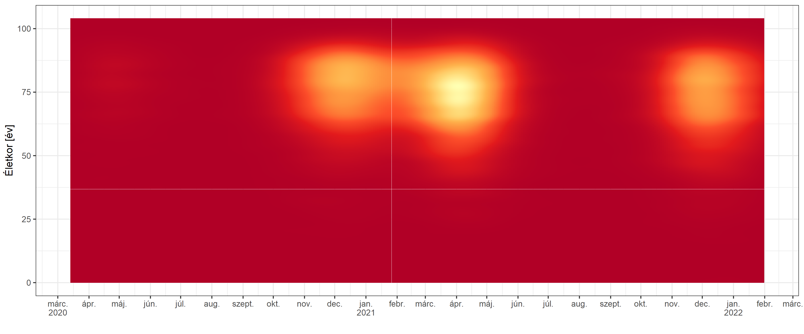<!-- -->

Nem túl látványos amit kaptunk, ennek az az oka, hogy egyben van simítva
az egész adatsor, így a kiugró halálozási napok magas sűrűsége annyira
összenyomja a színskálát, hogy ezen kívül szinte minden
megkülönböztethetetlenné válik. Ezen segíthetünk, ha nem lineárisan
színezünk:

``` r
ggplot(temp1, aes(x = Var1, y = Var2, fill = value)) + geom_tile() +
  scale_fill_distiller(palette = 'YlOrRd', trans = "sqrt") +
  scale_x_date(date_breaks = "month", date_labels = "%b") + labs(x = "", y = "Életkor [év]", fill = "")
```

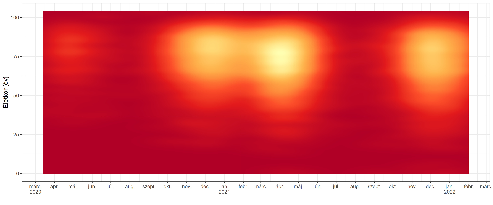<!-- -->

(Ez négyzetgyök-transzformációval készült; a nagyon extrém alacsony
értékek miatt érdekes módon a logaritmus még annál is rosszabb eredményt
ad, mint a kiindulási ábra)

Az igazi megoldás azonban az, ha kiszámoljuk adott napra a *feltételes*
eloszlást, tehát hogy a napon *belül* milyen volt az életkorok
eloszlása. Ezt kézzel megtehetjük könnyen:

``` r
temp2 <- as.data.table(reshape2::melt(t(apply(temp$z, 1, function(x) x/sum(x)))))
temp2$Var1 <- as.Date(temp2$Var1, origin = "1970-01-01")
```

És ezt ábrázolva megkapjuk a megfelelő végeredményt:

``` r
ggplot(temp2, aes(x = Var1, y = Var2, fill = value)) + geom_tile() +
  scale_fill_distiller(palette = 'YlOrRd') + scale_x_date(date_breaks = "month", date_labels = "%b") +
  labs(x = "", y = "Életkor [év]", fill = "")
```

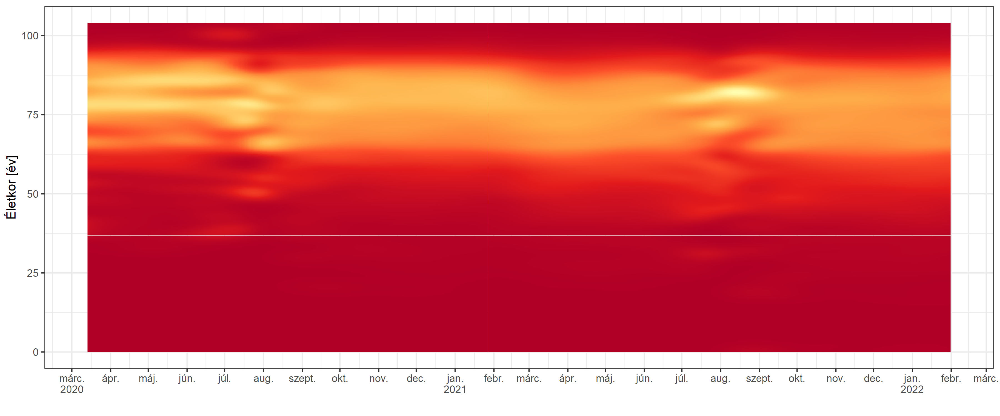<!-- -->

Látványosabbá tehetjük az eredményt, ha feltüntetjük az átlagos életkort
(mivel nagyon finom felbontásban megvan az eloszlást, ezt könnyen
kiszámolhatjuk, lényegében numerikusan integrálunk), illetve ábrázoljuk
csak a relevánsabb életkortartományt; ezt az ábrát fogjuk később
használni.

### Eredmények

Az adatbázis szerint az elhunytak közül 15244 fő (51.4%) férfi.

Az életkori eloszlás:

``` r
ggplot(MortData, aes(x = Age)) + stat_density(geom = "line", position = "identity") +
  labs(x = "Életkor [év]", y = "")
```

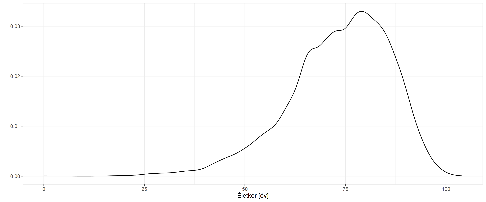<!-- -->

Az elhunytak életkori eloszlása nem szerint:

``` r
ggplot(MortData, aes(x = Age, color = Sex)) + stat_density(geom = "line", position = "identity") +
  labs(x = "Életkor [év]", y = "") + theme(legend.position = "bottom", legend.title = element_blank())
```

<!-- -->

(Ez az ábra a csoporton belüli eloszlást mutatja, tehát nem jeleníti
meg, hogy a férfiak és nők száma nem ugyanannyi.)

Ez annyiban félrevezető, hogy egybeönti az egész időszak adatait, pedig
ezek változhattak menet közben. Márpedig fontos lehet ezt is vizsgálni,
hátha eltolódik valamilyen irányba az elhunytak életkora! A férfiak és a
nők között nem volt nagy különbség, úgyhogy a továbbiakhoz kezeljük őket
egyben, viszont a kérdés vizsgálatához bontsuk meg az ábrát a dátum
szerint. Ehhez azonban más ábrázolásra lesz szükségünk. Az alábbi ábrán
a vízszintes tengelyen látható az idő, a függőleges tengelyen az
életkor, és minél világosabb egy pont annál gyakoribb az adott
időpontban az adott életkor előfordulása. Hogy jobban vezesse a szemet,
fehér vonal jelzi az átlagéletkor alakulását ahogy az idő halad előre:

``` r
ggplot(temp2, aes(x = Var1, y = Var2, fill = value)) + geom_tile() +
  scale_fill_distiller(palette = 'YlOrRd') +
  geom_line(data = temp2[,.(weighted.mean(Var2, value)), .(Var1)], aes(x = Var1, y = V1),
            inherit.aes = FALSE, color = "white") +
  lims(y = c(40, NA)) + scale_x_date(date_breaks = "month", date_labels = "%b") +
  labs(x = "", y = "Életkor [év]", fill = "")
```

    ## Warning: Removed 74191 rows containing missing values (geom_tile).

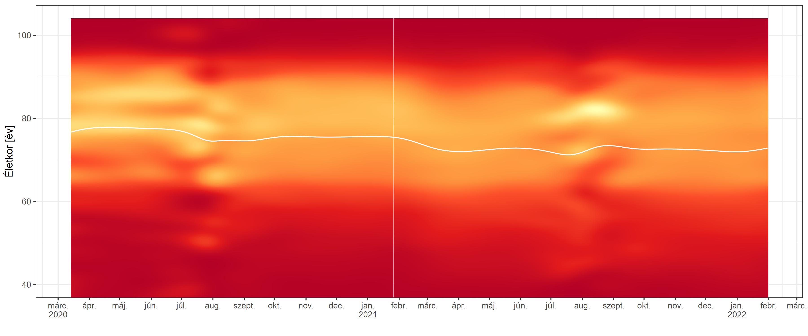<!-- -->

### Értelmezés, következtetések, limitációk

Ami az összesített életkori eloszlást illeti, az ábra mutatja, hogy mely
életkorból kerül ki az elhunytak többsége. Csábító lenne azt gondolni,
hogy ez mutatja az adott életkor kockázatát, de ez nem igaz (gondoljunk
csak a 100 évesekre: nyilván nem arról van szó, hogy ott már nagyon pici
a kockázat, hanem arról, hogy eleve is rendkívül kevés ilyen életkorú
lakos van, így közülük akár már kis számú halál is jelezhet nagyon nagy
kockázatot).

Az előbbi zárójeles gondolat sugallhat egy olyan ötletet, hogy akkor a
halottak számát adott életkorban osszuk el az olyan életkorú emberek
számával az országban. Ez már tényleg megfelelő kockázat-mutatónak
tűnik, de vigyázzunk: ez még mindig nem jó, hiszen a kockázatot –
természetesen – az fejezi ki, hogy a *fertőzöttek* mekkora hányada hal
meg (nem a lakosoké). Az viszont nem tudhatjuk, hogy a lakosok hány
százaléka fertőzött, pláne nem életkoronként! Lényegében azt mondhatjuk,
hogy a fenti leosztás *csak* akkor működne, ha minden életkorban az
egész lakosság fertőződött volna.

Ha legalább az igaz lenne, hogy minden életkorban azonos az
átfertőzöttség (ha nem is 100%), akkor még lehetne értelme a
leosztásnak, hiszen mondhatnánk, hogy bár a konkrét számok nem igazak,
de mindegyik ugyanannyival van elcsúszva (például ha valójában minden
életkorban 50% az átfertőzöttség, akkor a valódi kockázat a számolt
kétszerese – de minden életkorban kétszerese), így legalább a relatív
viszonyok, tehát a görbe alakja jó lenne. Sajnos ezt sem tudhatjuk.

Ennek ellenére egy értelme mégis lehet egy ilyen számításnak: alsó
korlátot ad a halálozási arányra! Azt mondhatjuk, hogy még ha 100% is
lenne az átfertőzöttség, akkor is legalább ennyi a halálozási arány… a
valódi átfertőzöttség ennél csak kisebb lehet, így a valódi halálozási
arány csak nagyobb. Ezt az alsó korlátot mutatja az alábbi ábra (első
lépésben letöltjük hozzá az Eurostat-tól a korfát, majd életkor és nem
szerint rétegezzük az adatainkat, és így kapcsoljuk össze a korfával):

``` r
PopData <- as.data.table(eurostat::get_eurostat("demo_pjan"))
```

    ## Table demo_pjan cached at C:\Users\FERENC~1\AppData\Local\Temp\Rtmp6Bhx7z/eurostat/demo_pjan_date_code_FF.rds

``` r
PopData <- PopData[geo=="HU"&sex!="T"&!age%in%c("TOTAL", "UNK")&time=="2020-01-01"]
PopData$age[PopData$age=="Y_LT1"] <- "Y0"
PopData$age[PopData$age=="Y_OPEN"] <- "Y100"
PopData$Age <- as.numeric(substring(PopData$age, 2))
PopData$Sex <- ifelse(PopData$sex=="F", "Nő", "Férfi")

MortData$AgeMax100 <- MortData$Age
MortData$AgeMax100[MortData$AgeMax100>100] <- 100

setkey(MortData, Sex, AgeMax100)
MortDataStratified <- MortData[CJ(Sex = c("Férfi", "Nő"), AgeMax100 = 0:100), .N, by = .EACHI]

MortDataStratified <- merge(MortDataStratified, PopData[,.(AgeMax100 = Age, Sex, Pop = values)])

MortDataStratified$Mort <- MortDataStratified$N / MortDataStratified$Pop*100
MortDataStratified$Sex <- as.factor(MortDataStratified$Sex)

fit <- mgcv::gam(N ~ s(AgeMax100, by = Sex) + Sex, offset = log(Pop), data = MortDataStratified, family = poisson)
MortDataStratified$Pred <- predict(fit, type = "response")*100
MortDataStratified$PredSE <- predict(fit, type = "response", se.fit = TRUE)$se.fit
MortDataStratified$PredCIlwr <- MortDataStratified$Pred - 1.96 * MortDataStratified$PredSE * 100
MortDataStratified$PredCIupr <- MortDataStratified$Pred + 1.96 * MortDataStratified$PredSE * 100

p <- ggplot(MortDataStratified, aes(x = AgeMax100, group = Sex, color = Sex, fill = Sex)) +
  geom_line(aes(y = Mort), alpha = 0.3) + geom_line(aes(y = Pred)) +
  geom_ribbon(aes(ymin = PredCIlwr, ymax = PredCIupr), color = NA, alpha = 0.4) +
  labs(x = "Életkor [év]", y = "Halálozási arány alsó korlátja [%]") + coord_cartesian(xlim = c(20, NA)) +
  theme(legend.position = "bottom", legend.title = element_blank())
p
```

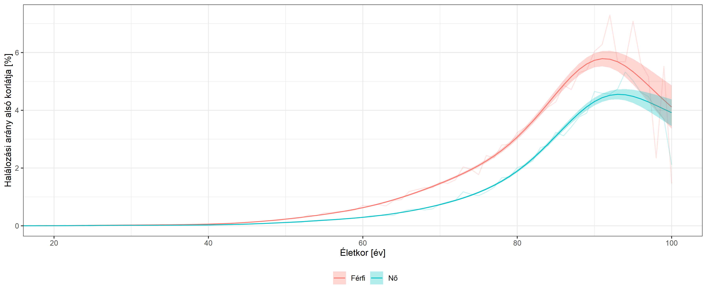<!-- -->

Az ábrán a vastag vonal a – spline-nal – simított becslést, a halvány
vonal az életévenkénti számítás eredményét mutatja; a satírozott
tartomány a 95%-os konfidenciaintervallum. Érdemes a jobb láthatóság
miatt az ábrát logaritmikus függőleges tengellyel is megnézni:

``` r
p + scale_y_log10(breaks = c(1, 0.1, 0.01, 0.001, 0.0001), labels = c(1, 0.1, 0.01, 0.001, "0.0001"))
```

<!-- -->

(Megjegyzés: a fenti értelemben vett halálozási arányt, tehát amikor a
halottak számát a fertőzöttek számával osztjuk, szokás IFR-nek nevezni.
Ez, és csak ez méri a betegség súlyosságát. A halottak számának a
regisztrált esetekhez való viszonyítása – rövidítése általában CFR – bár
kézenfekvőnek tűnhet, erre a célra alkalmatlan, hiszen az, hogy a
fertőzöttek mekkora száma kerül detektálásra, a tesztelési aktivitástól
is függ. Emiatt a CFR nem jó mutatója a betegség súlyosságának, hiszen
befolyásolja a tesztelés intenzitása is.)

Végezetül érdemes megjegyezni, hogy *minden* olyan vizsgálat, ami a
halálozásokon alapul természetesen érzékeny arra, hogy pontosan milyen
definíciókat alkalmazunk a halálozások halálokhoz rendelésében. Ennek
kérdéseit részletese tárgyalom a [egy másik
írásomban](https://github.com/tamas-ferenci/ExcessMortEUR).

Mi a helyzet az életkori arány eltolódásával? Ez kicsit nehezebb kérdés,
hiszen elvileg két oka lehet az eltolódásának: a fertőzöttek életkori
eloszlásának változása, illetve a korspecifikus halálozás megváltozása.
Önmagában a halottak életkorának ismerete nem teszi lehetővé e kettő
elkülönítését: egy csökkenés lehet azért is, mert a járvány fiatalabb
korosztályban kezd terjedni, vagy azért is, mert megnő a súlyosság
(pláne, ha ez elsősorban a fiatalokat érinti), vagy a kettő

## Az elhunytak társbetegségei külön-külön vizsgálva

### Technikai részletek

A kikódolás részleteit lásd korábban.

### Eredmények

Nézzük meg, hogy az elhunytak mekkora hányada szenvedett a 11 vizsgált
társbetegségben (azaz mekkora volt a társbetegségek prevalenciája):

``` r
ggplot(merge(melt(MortData,  measure.vars = ComorbLabels$variable), ComorbLabels)[
  ,.(mean(value)*100, binom.test(sum(value), length(value))$conf.int[1]*100,
     binom.test(sum(value), length(value))$conf.int[2]*100), .(varlabel)],
  aes(x = varlabel, y = V1, ymin = V2, ymax = V3)) +
  geom_point(position = position_dodge(width = 0.5)) + coord_flip() +
  geom_errorbar(width = 0.5) + labs(x = "", y = "Prevalencia [%]")
```

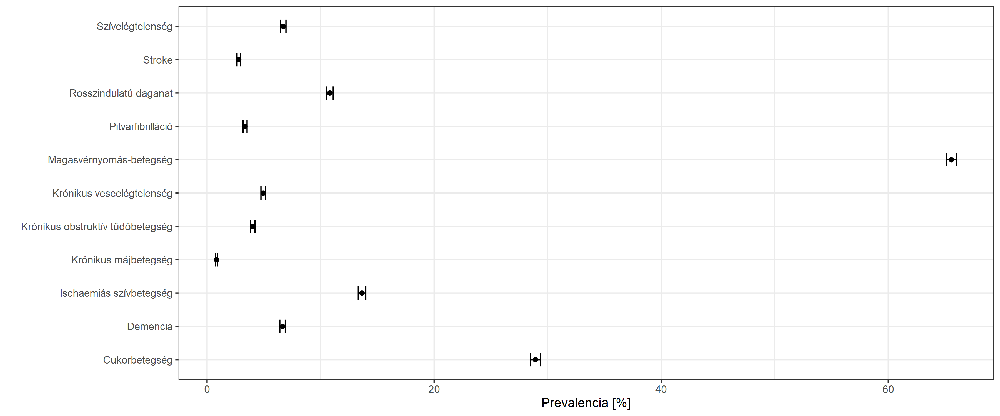<!-- -->

Érdekes – és fontos – kérdés, hogy ez hogyan néz ki életkoronként és
nemenként. Az életkort (természetesen!) folytonos változóként kezeljük,
és megengedjük, hogy az életkori mintázat eltérjen nemenként (azaz, hogy
interakció legyen a két változó között). A megfelelő eszköz ehhez a
spline-regresszió (GAM), amit az `mgcv` csomaggal fogunk megvalósítani,
mind a 11 társbetegségre külön-külön:

``` r
predgrid <- expand.grid(Age = seq(50, 100, 0.1), Sex = c("Férfi", "Nő"))
ComorbPrevs <- rbindlist(setNames(lapply(ComorbLabels$variable, function(v) {
  fit <- mgcv::gam(as.formula(paste0(v, "~ s(Age, by = Sex) + Sex")), data = MortData, family = binomial)
  cbind(predgrid, with(predict(fit, predgrid, se.fit = TRUE),
                       data.frame(est = plogis(fit), lwr = plogis(fit - 1.96*se.fit),
                                  upr = plogis(fit + 1.96*se.fit))))
}), ComorbLabels$varlabel), idcol = TRUE)
ggplot(ComorbPrevs, aes(x = Age, y = est*100, color = Sex, fill = Sex, ymin = lwr*100, ymax = upr*100)) +
  geom_line() + geom_ribbon(alpha = 0.2, linetype = 0) + facet_wrap(~.id) +
  labs(x = "Életkor [év]", y = "Prevalencia [%]") +
  theme(legend.position = "bottom", legend.title = element_blank())
```

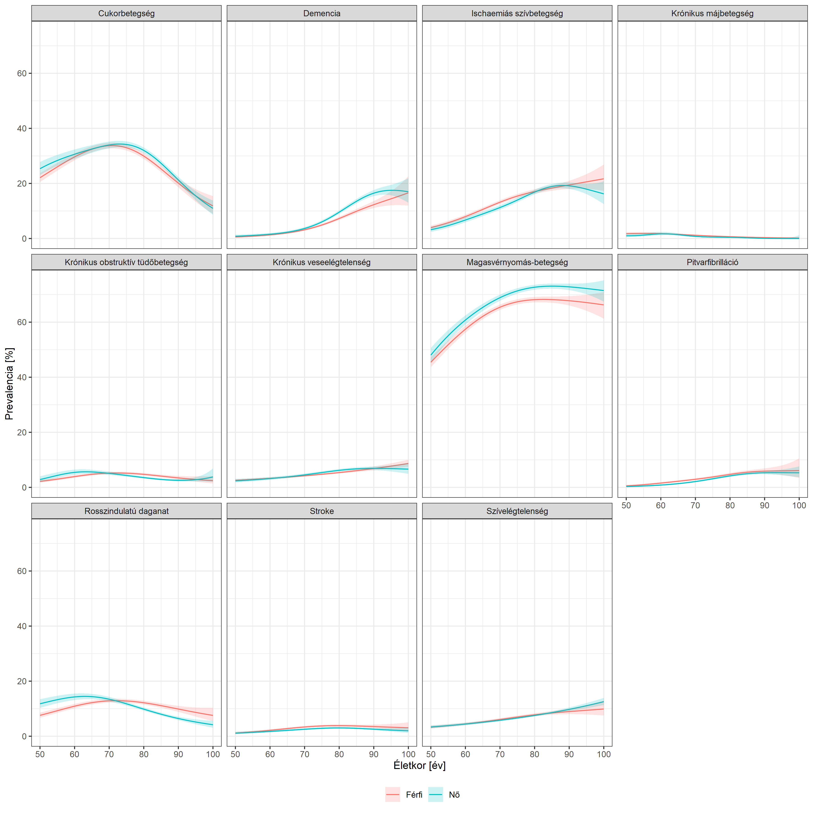<!-- -->

Érdekes kérdés a komorbiditások együttes előfordulása. Ennek
legprimitívebb vizsgálati módszere, ha egyszerűen megszámoljuk a
darabszámukat adott elhunytra:

``` r
MortData$ComorbCount <- rowSums(MortData[, ComorbLabels$variable, with = FALSE])
```

Nézzük hogyan alakul ennek a megoszlása:

``` r
ggplot(MortData, aes(x = ComorbCount)) + geom_bar() + labs(x = "Társbetegségek száma", y = "Gyakoriság [fő]")
```

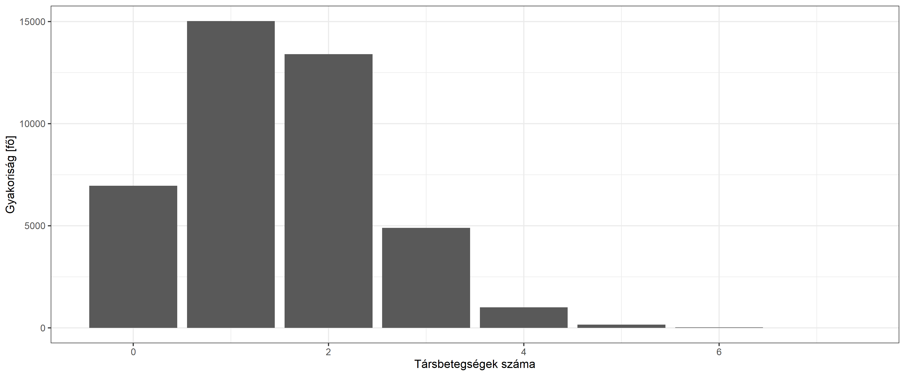<!-- -->

Itt is vizsgáljuk meg a kérdést kor- és nemspecifikusan:

``` r
ggplot(reshape2::melt(table(MortData$ComorbCount, MortData$Age, MortData$Sex)),
       aes(x = Var2, fill = forcats::fct_rev(as.factor(Var1)), y = value)) +
  geom_area(position = "fill", alpha = 0.7) +
  facet_grid(cols = vars(Var3)) + scale_x_continuous(expand = c(0, 0), limits = c(50, 90)) +
  scale_y_continuous(labels = scales::percent_format(suffix = ""), expand = c(0, 0)) + 
  labs(x = "Életkor [év]", y = "Arány [%]", fill = "Társbetegségek száma") +
  guides(fill = guide_legend(reverse = TRUE)) +
  theme(legend.position = "bottom", legend.title = element_blank(), panel.spacing = unit(1, "lines"))
```

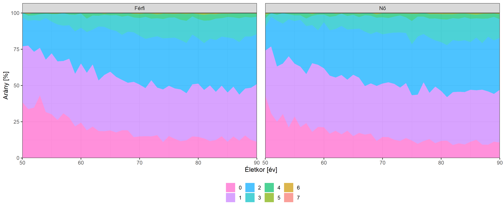<!-- -->

### Értelmezés, következtetések, limitációk

Az egyik legtermészetesebb kérdés, amire sokan választ szeretnének
kapni, hogy melyik társbetegség növeli meg (és mennyire) a
koronavírusban történő elhalálozás kockázatát. A kérdés valóban nagyon
fontos, azonban ha a fenti adatok alapján akarnánk rá válaszolni, akkor
a következő szempontokra muszáj felhívni a figyelmet:

-   A fenti százalékok önmagukban semmit nem jelentenek. Simán lehet,
    hogy egy társbetegség, ami az elhunytak 20%-ában van jelen, növeli a
    kockázatot, és egy olyan, ami 40%-ában, csökkenti. Miért? Mert nem
    tudjuk, hogy a társbetegség a *nem elhunytak* mekkora százalékában
    volt jelen! A “növelni” szó csak összehasonlításban értelmezhető –
    növelni csak valamihez *képest* lehet egy adott értéket. Azaz: a
    fenti százalékok csak úgy jelentenek bármit is, ha tudnánk, hogy az
    összlakosságban mekkora a társbetegség elterjedtsége. Az, hogy
    valami az elhunytak 40%-ában van jelen, bár ijesztőnek hangozhat,
    semmit nem jelent: ha az összlakosságnak 30%-ában, akkor tényleg
    kockázati tényező, ha 40%-ában, akkor semmi jelentősége, ha
    50%-ában, akkor még védőhatású is a jelen járványban történő
    halálozás szempontjából! Önmagában a 40% mindhárom lehetőséggel
    kompatibilis!
-   A fenti probléma mélyebb oka, hogy az itt látott százalékok (az
    elhunytak mekkora része szenved adott betegségben) bármilyen
    természetesnek is tűnnek, valójában egy teljesen természetellenes
    kérdésre válaszolnak. Ezek ugyanis azt mondják meg, hogy feltéve,
    hogy meghal valaki, mekkora valószínűséggel szenvedett egy adott
    betegségben – holott a gyakorlatban teljesen nyilvánvalóan pont a
    fordítottja a releváns kérdés, ha valaki szenved egy adott
    betegségben, mekkora valószínűséggel hal meg! A kettő azonban nagyon
    nem ugyanaz, épp az előző pontban írtak miatt. Ez lényegében ugyanaz
    a kérdés, amit az [orvosi tesztekről szóló
    írásomban](https://github.com/tamas-ferenci/OrvosiSzures)
    körbejártam.
-   Valójában még ez az egyszerű összehasonlítás sem korrekt. Hiszen
    könnyen lehet, hogy az elhunytak és a nem elhunytak egyéb
    jellemzőikben is eltérnek, nem csak a vizsgált társbetegségben
    szenvedésben, így ha találunk is különbséget, nem tudhatjuk
    biztosan, hogy az tényleg a társbetegség, és nem az egyéb
    különbség(ek) miatt van. A fenti elemzés két fontos szempont
    figyelembevételét teszi lehetővé: az életkorét és a nemét. Magyarán,
    nem azt kell kivenni az adatbázisból, hogy összességében mekkora
    arány szenved egy adott társbetegségben, hanem azt, hogy ez adott
    életkorban és nemben mennyi, és hasonlóan, ezt nem az országos
    összadathoz, hanem adott életkor és nem adatához kell hasonlítani.
    Így legalább az életkor és a nem esetleges zavaró hatásától meg
    tudunk szabadulni. (Ezért félrevezető egy olyan elemzés, ami ezt a
    kettőt nem veszi figyelembe. Persze még ez is rossz lehet, ha az
    életkoron és a nemen túl vannak további zavaró tényezők.)
-   Vegyük azt is figyelembe, hogy az is számít, hogy adott betegséggel
    mennyi időt töltenek el az emberek. Rosszindulatú daganattal sajnos
    sokszor csak hónapokat, legfeljebb néhány évet, míg magas
    vérnyomással minden további nélkül lehet sok évtizedet. Ez azért
    fontos, mert így természetesen annak is sokkal nagyobb lesz az
    esélye, hogy valaki magas vérnyomásos, miközben elkapja a
    koronavírust és meghal, míg egy ráknál erre rövidebb az “időablak”.
    Tehát nem az számít, hogy az emberek mekkora része hal bele egy
    betegségbe, hanem, hogy mennyi a vele töltött átlagos idő.

## Társbetegségek kombinációi

A fenti elemzés semmit nem mond a társbetegségek együttes
előfordulásáról: vannak társbetegség-kombinációk amik aránytalanul
gyakoriak, vagy épp ritkák? (Természetesen ne felejtsük semmikor: most
kizárólag a koronavírusban érintett, és azon belül is csak az abban meg
is haló alanyok társbetegségeiről beszélünk!)

### Technikai részletek

Úgy fogunk számolni, hogy minden lehetséges társbetegség-párra
elkészítjük a kontingenciatáblájukat, majd abból kiszámítjuk az
általában használatos metrikákat – esélyhányados (OR), relatív rizikó
(RR), Yule-féle *Q*, Pearson-féle *φ*, tetrahorikus korreláció – az
asszociáció szorosságának mérésére is (valamint a nyers, együttes
előfordulás-számot is):

``` r
comorbcombs <- CJ(ComorbLabels$variable, ComorbLabels$variable)
comorbcombs <- cbind(comorbcombs, rbindlist(lapply(1:nrow(comorbcombs), function(i) {
  tab <- table(MortData[[comorbcombs$V1[i]]], MortData[[comorbcombs$V2[i]]])
  data.table(cooccurr = tab[2, 2]/nrow(MortData),
             or = epitools::epitab(tab, method = "oddsratio")$tab["TRUE", "oddsratio"],
             rr = epitools::epitab(tab, method = "riskratio")$tab["TRUE", "riskratio"], phi = psych::phi(tab),
             yule = psych::Yule(tab), tetrachoric = psych::tetrachoric(tab)$rho)
})))
comorbcombs$logit <- log(comorbcombs$or)
comorbcombs <- merge(comorbcombs, ComorbLabels[,.(V1 = variable, V1label = varlabel)], by = "V1")
comorbcombs <- merge(comorbcombs, ComorbLabels[,.(V2 = variable, V2label = varlabel)], by = "V2")
```

A kor és a nem hatását úgy fogjuk kontrollálni, hogy egy logisztikus
regressziót futtatunk le, ismét csak, minden pár között. Igazából a
fenti esélyhányadost is megkaphattuk volna egy logisztikus
regresszióból, amelyben az egyik társbetegség az eredményváltozó, és a
másik az – egyedüli – magyarázó változó. Ebben a keretben már nagyon
természetes a kontrollálás: egyszerűen berakjuk pluszban magyarázó
változóként az életkort és a nemet is. Az életkort spline-nal kibontjuk,
hogy megengedjük az esetleges nemlineáris hatását, valamint az életkor
és a nem között megengedjük az interakciót:

``` r
comorbcombs$adjor <- sapply(1:nrow(comorbcombs), function(i)
  exp(coef(mgcv::gam(as.formula(paste0(comorbcombs$V1[i], "~ s(Age, by = Sex) + Sex +", comorbcombs$V2[i])),
                     data = MortData, family = binomial))[3]))
```

### Eredmények

Nézzük először a társbetegségeket páronként. Az alábbi ábra a szín
világosságával mutatja, hogy az egyes kombinációknak mekkora a
prevalenciája, azaz az elhunytak mekkora hányada szenvedett az adott
társbetegség-párban (természetesen nem feltétlenük *csak* abban a
kettőben):

``` r
ggplot(comorbcombs, aes(x = stringr::str_wrap(V1label, 15), y = stringr::str_wrap(V2label, 15),
                        fill = cooccurr*100)) +
  geom_raster() + scale_fill_continuous(trans = "log10") + labs(x = "", y = "", fill = "Prevalencia [%]") +
  scale_x_discrete(guide = guide_axis(angle = 90))
```

<!-- -->

Vigyázzunk, hogy a színezés logaritmikus, hogy a kis prevalenciák is
láthatóak legyenek. A főátlóban találjuk a sima, korábban is látott
prevalenciákat, és az ábra természetesen szimmetrikus.

Akkor ebből már láthatjuk, hogy melyik azok a párok amik hajlamosabbak
együtt előfordulni? Nem. A probléma az, hogy *önmagában* az, hogy egy
adott pár gyakran fordul elő, még nem jelenti ezt – mert figyelmen kívül
hagyja, hogy a pár tagjai külön-külön milyen gyakran fordulnak elő! Ha
gyakran, akkor még egy meglehetősen gyakori együttes előfordulás sem
feltétlenül jelent összefüggést. Ha az alanyok 60% szenved az egyik
társbetegségben, 30%-a egy másikban, akkor 0, 6 ⋅ 0, 3 = 18%-ra várjuk
azok arányát akiknél mindkettő előfordul – *akkor is* ha a két
társbetegség független egymástól! Simán lehet, hogy egy sor társbetegség
önmagában sincs 18%, miközben ennél a kombinációnál a 18% még azt
jelenti, hogy nincs kapcsolat. Ez egyúttal azt is mutatja, hogy mit kell
mérnünk: hogy mennyire megy az együttes előfordulás a 18% *fölé*, ez
jelenti ugyanis az együttjárást.

Számos konkrét mutató létezik attól függően, hogy ezt pontosan hogyan
mérjük le. Az egyik népszerű a Pearson-féle *φ*, melynek 0 értéke jelzi,
ha nincs együttjárás, pozitív értéke pozitív, negatív értéke negatív
kapcsolatot jelent a két társbetegség között:

``` r
ggplot(comorbcombs[V1!=V2], aes(x = stringr::str_wrap(V1label, 15),
                                y = stringr::str_wrap(V2label, 15), fill = phi))+
  geom_raster() + labs(x = "", y = "") + scale_x_discrete(guide = guide_axis(angle = 90)) +
  scale_fill_gradient2(limits = c(-max(abs(range(comorbcombs[V1!=V2]$phi))),
                                  max(abs(range(comorbcombs[V1!=V2]$phi)))))
```

<!-- -->

Egy másik népszerű metrika az esélyhányados (hányszorosára nő az egyik
társbetegség előfordulásának az esélye – nem a valószínűsége! – ha a
másik jelen van):

``` r
ggplot(comorbcombs[V1!=V2], aes(x = stringr::str_wrap(V1label, 15), y = stringr::str_wrap(V2label, 15),
                                fill = or)) +
  geom_raster() + scale_fill_gradient2(limits = c(0, max(comorbcombs[V1!=V2]$or)), midpoint = 1) +
  scale_x_discrete(guide = guide_axis(angle = 90)) + labs(x = "", y = "")
```

<!-- -->

Mivel ez egy szorzó (hány*szorosára* nő), így az 1 jelenti azt, hogy
nincs összefüggés, az 1 fölötti értékek a pozitív, az 1 alattiak a
negatív kapcsolatot.

Akármelyik mutatót is használjuk, az összkép hasonló: a magasvérnyomás
és a cukorbetegség, a pitvarfibrilláció és a szívelégtelenség, valamint
a krónikus veseelégtelenség és a szívelégtelenség kiemelten hajlamos
együttjárni, ezen felül még az ischaemiás szívbetegség és a
pitvarfibrilláció mutat több közepesen erős együttjárást. A
rosszindulatú daganat és a krónikus májbetegség viszont mintha
“taszítaná” a többi betegséget, azaz, a fennállásuk esetén aránytalanul
ritka, hogy más társbetegség is együttesen jelen legyen még. Kiemelten
ritkán fordul elő a stroke és a krónikus májbetegség kombinációja.

Érdekes egy kicsit elgondolkozni a rosszindulatú daganat példáját, mert
ad egy fontos elemzési ötletet. Mi lehet ezeknek a negatív
asszociációknak az oka? Valószínűleg nagyon fontos komponens, amiről
korábban szó volt, hogy kevesebb ideig élnek ezzel együtt az emberek, de
az a gondolat is felmerülhet, hogy a rákosok egyszerűen fiatalabbak
relatíve (ha megnézzük a korábbi eredményeket, ez tényleg így van). Ez
utóbbi viszont ad egy ötletet: valahogy kontrollálni kell ezekre a
tényezőkre. Használjunk egy többváltozós regressziós modellt, hiszen az
pont erre szolgál: az ebben kapott eredmény, ha berakjuk az életkort és
a nemet további magyarázó változóként, úgy lesz értendő, hogy adott
betegség és a másik között mi az összefüggés *ha* közben az életkort és
a nemet rögzítetten tartjuk. Ez épp a problémánkat szünteti meg, tehát
azt, hogy a betegségben szenvedők egyúttal idősebbek, és a másik
betegség gyakoribb előfordulásának valójában a magasabb életkor az oka.
Az esélyhányados lesz az erre továbbvihető mutató, az ugyanis
előállítható egy megfelelően választott ilyen regressziós modellel:

``` r
ggplot(comorbcombs[V1!=V2], aes(x = stringr::str_wrap(V1label, 15), y = stringr::str_wrap(V2label, 15),
                                fill = adjor)) + geom_raster() +
  scale_fill_gradient2(limits = c(0, max(comorbcombs[V1!=V2]$adjor)), midpoint = 1) +
  scale_x_discrete(guide = guide_axis(angle = 90)) + labs(x = "", y = "")
```

<!-- -->

Látszik, hogy az alaphelyzet nem változott, így most már tudhatjuk, hogy
a látottak nem az életkor és nem miatti
[confounding](https://tamas-ferenci.github.io/FerenciTamas_AzOrvosiMegismeresModszertanaEsAzOrvosiKutatasokKritikusErtekelese/)
következményei.

A társbetegségek kapcsolatának van egy további, gyakorlatban népszerű
elemzési (és megjelenítési) megközelítése: tekintsük őket egy
hálózatnak, matematikusabb szóval gráfnak! Ekkor minden társbetegségnek
megfelel egy pont, a köztük lévő kapcsolatokat pedig úgy szemléltetjük,
hogy a pontokat összekötjük. A dolog kicsit cicomázható is: a pontok
mérete legyen arányos az adott betegség (önmagában vett) előfordulási
gyakoriságával, az összekötő egyenes vastagsága pedig a két betegség
közti kapcsolat erősségével. Ez akkor jeleníthető meg igazán jól, ha
csak a pozitív kapcsolatokat tekintjük, sőt, azt átláthatóság kedvéért
csak azokat az összeköttetéseket rajzoljuk ki, ahol az esélyhányados
több mint 1,3 (az egyik előfordulása legalább 30%-kal növeli a másik
előfordulásának az esélyét):

``` r
comorbnet <- igraph::graph_from_data_frame(comorbcombs[V1!=V2&or>1.3, .(V1, V2, or)],
                                           vertices = comorbcombs[V1==V2, .(V1, cooccurr, V1label)])
plot(comorbnet, vertex.size = igraph::V(comorbnet)$cooccurr*30,
     vertex.label = stringr::str_wrap(igraph::V(comorbnet)$V1label, 20),
     edge.width = igraph::E(comorbnet)$or*2)
```

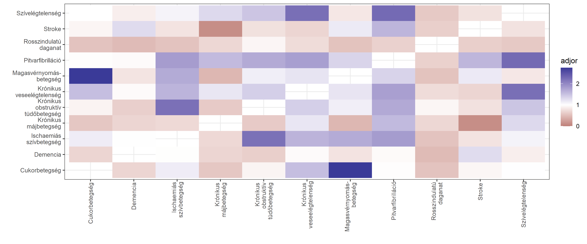<!-- -->

Ez a megközelítés különösen akkor hasznos, ha a fentinél jóval több
társbetegséget tudunk vizsgálni.

Végezetül egy szóval térjünk ki arra is, hogy mi a helyzet, ha kettőnél
több társbetegség kapcsolatát akarjuk vizsgálni. Ilyenkor a helyzet
gyorsan bonyolódik: egyrészt a lehetséges kombinációk száma nagyon
gyorsan megnő, másrészt nem lesz egyértelmű, hogy hogyan mérjük az
együttjárást (vagy, hogy egyáltalán mit értünk ez alatt).

Egy alternatív lehetőség az ún. UpSet-diagramok használata. Ez egy
szellemesen definiált módon megkeresi a leggyakoribb kombinációkat
(tetszőleges számú társbetegséggel, lehet 0 is, 1, is, 2 is, de 2-nél
több is – ez nincsen megkötve, ezt szintén az algoritmus találja ki!),
és ezeket egy jól értelmezhető formában elrendezi:

``` r
ComplexUpset::upset(
  MortData, ComorbLabels$variable, keep_empty_groups = TRUE, n_intersections = 20,
  name = "", set_sizes = FALSE,
  base_annotations = list(
    "Intersection size" = (
      ComplexUpset::intersection_size() +
        ylab("Társbetegségek együttes \nelőfordulási gyakorisága \n(első 20)")
    )),
  annotations = list(
    "Koreloszlás" = (
      ggplot(mapping = aes(y = Age)) +
        geom_violin() + geom_boxplot(width = 0.1, color = "grey", alpha = 0.2, outlier.shape = NA) +
        geom_hline(yintercept = mean(MortData$Age), linetype = "dashed", color = "red")
    ),
    "Nem szerinti arányok" = (
      ggplot(mapping = aes(fill = Sex)) +
        geom_bar(position = "fill") + scale_y_continuous(labels = scales::percent_format()) +
        geom_hline(yintercept = 0.5, linetype = "dashed", color = "grey") +
        labs(y = "Nemek aránya", fill = "")
    )
  )
)
```

<!-- -->

Az ábra alján látjuk a kombinációkat: amely betegségeket fekete pötty
jelöl és függőlegesen össze vannak kötve, azok kombinációját jelenti a
kérdéses oszlop. Felette található az adott kombináció gyakorisága, de
fontos, hogy ez úgy értendő, hogy mennyi beteg van *pontosan* ezzel a
kombinációval. (Tehát például ahol egyedül a magasvérnyomásnál van
fekete pötty, az nem azt jelenti, hogy hányaknak van magas vérnyomása,
hanem azt, hogy hányaknak van *csak* magas vérnyomása.)

A felette lévő két diagram pedig az életkor és a nem eloszlását adja meg
a kérdéses kombinációban, így az is érzékelhetővé válik, hogy ilyen
szempontból eltérnek-e az egyes kombinációk.

Az ábra a 20 leggyakoribb kombinációt tartalmazza.

## Továbbfejlesztési ötletek

-   [x] Korspecifikus halálozás, mint alsó becslés az IFR-re.
-   [ ] Másféle KDE (pl. `ks` csomag) az életkori viszonyok időbeli
    alakulásának becslésére, vagy spline-ok.
-   [ ] További betegségek kikódolása.
-   [ ] Konfidenciaintervallum az átlagéletkorra.
-   [ ] Medián használata az életkor alakulásánál (`Hmisc::wtd.quantile`
    vagy numerikusan?).
-   [ ] Színskála eltüntetése?
-   [ ] Normálisabb konfidenciaintervallum a GAM-ra (`gratia`?).
-   [x] Komorbiditások számának életkor- és nemspecifikus vizsgálata.
-   [x] Komorbiditások kombinációinak komplexebb vizsgálata.
-   [ ] Részletesebb leírás, hogy az UpSet-diagramot hogyan kell
    olvasni.

## Köszönetnyilvánítás

Köszönöm Balázs Tamásnak, hogy felhívta a figyelmemet az UpSet
módszertanra.

## Irodalmi hivatkozások

-   Lex, Alexander, et al. “UpSet: visualization of intersecting sets.”
    IEEE Transactions on Visualization and Computer Graphics 20.12
    (2014): 1983-1992. DOI: 10.1109/TVCG.2014.2346248.
    [Link](https://ieeexplore.ieee.org/document/6876017).
-   Cramer, Angélique OJ, et al. “Comorbidity: A network perspective.”
    Behavioral and Brain Sciences 33.2-3 (2010): 137. DOI:
    10.1017/s0140525x09991567.
    [Link](https://www.cambridge.org/core/journals/behavioral-and-brain-sciences/article/abs/comorbidity-a-network-perspective/4A9FE571B49A9150DFABCD5845EC0B3D).
-   Hidalgo, César A., et al. “A dynamic network approach for the study
    of human phenotypes.” PLoS Comput Biol 5.4 (2009): e1000353. DOI:
    10.1371/journal.pcbi.1000353.
    [Link](https://journals.plos.org/ploscompbiol/article?id=10.1371/journal.pcbi.1000353).
